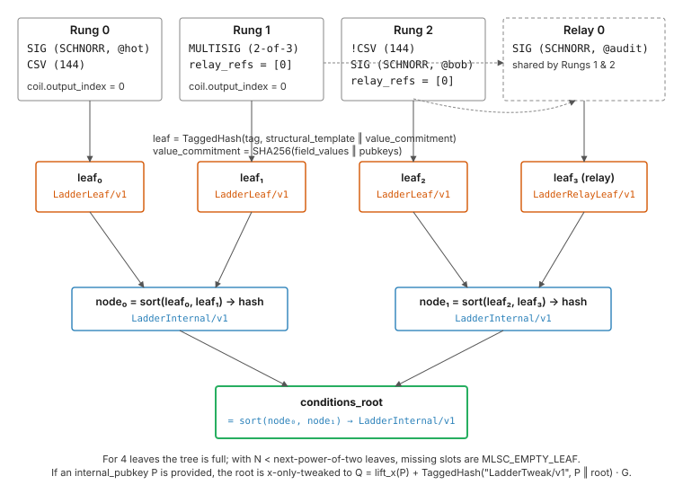
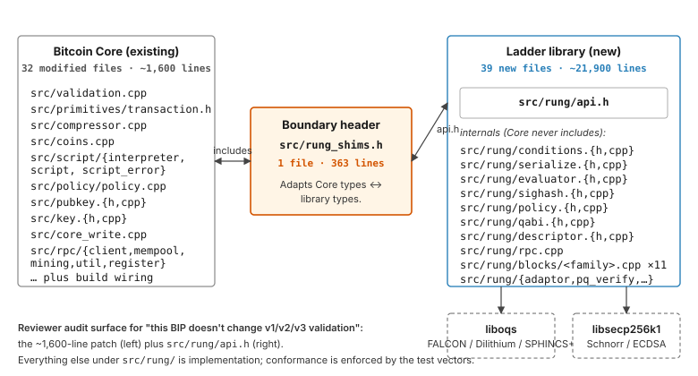

```
BIP: XXXX
Layer: Consensus (soft fork)
Title: Ladder Script — Typed Spending Conditions and Merkelised Ladder Script Conditions (MLSC)
Author: Defenwycke <defenwycke@icloud.com>
Comments-Summary: No comments yet.
Comments-URI: https://github.com/bitcoin/bips/wiki/Comments:BIP-XXXX
Status: Draft
Type: Standards Track
Created: 2026-05-01
License: BSD-2-Clause
Requires: 141, 340, 341
```

## Abstract

This document specifies Ladder Script, a transaction format and
spending-condition language deployed as Bitcoin transaction version 4
(`RUNG_TX`). Ladder Script replaces stack-of-bytes Bitcoin Script with a
fixed registry of 65 typed spending blocks organised into rungs that
evaluate by AND-within-rung and OR-across-rungs. Every output in a v4
transaction is committed by a single transaction-level Merkle root —
Merkelised Ladder Script Conditions (MLSC) — encoded in 8 wire bytes
per output and 3 chainstate bytes per coin after the standard UTXO
compressor. The proposal includes one `SigVersion`, two sighash
variants for per-input signatures, a key-path tweak distinct from BIP
341, native post-quantum signature schemes (FALCON-512 and -1024,
Dilithium3, SPHINCS+), and an N-party batched-PQ extension (`QABIO`).
Activation deploys all 65 blocks together using BIP 9 version-bits
signalling; pre-activation nodes treat v4 as anyone-can-spend. A
reference implementation, a live development signet, and browser-
based exploratory tools for transaction construction and batch-
ceremony walkthrough are available at <https://ladder-script.org>.

## Copyright

This BIP is licensed under the BSD-2-Clause license.

## Motivation

A Bitcoin transaction commits to a future spend through a script. Once
confirmed, that script's bytes sit unmoving in the chainstate of every
node on the network until the output is spent. Today the script is a
stack of opaque byte arrays. A 33-byte public key, a 32-byte hash, a
4-byte timelock, and a 32-byte image of an animated frog are
indistinguishable to the protocol — every byte's meaning lives in
unwritten convention between the wallet that wrote the script and the
wallet that will satisfy it. The protocol enforces no type, no shape,
no commitment beyond "execute these opcodes against this stack".

Three consequences fall out of that choice.

First, every new spending capability is its own multi-year coordination
problem. Adding a covenant primitive means defining an opcode, securing
review of its interaction with every other opcode in the wider script,
and persuading the network to activate a soft fork for one feature.
The cost of capability is so high that the network can only afford a
handful per decade.

Second, the protocol cannot tell instructions from data. A witness
that pushes 100 KB of arbitrary bytes onto the stack and uses
`OP_DROP` to discard them — or wraps them inside `OP_FALSE OP_IF
... OP_ENDIF` so they never execute — produces a transaction that
verifies and lands in a block. The bytes are paid for at the witness
discount rate and live on every full node forever. This is the
mechanism the Ordinals inscription pattern exploits inside Taproot
script-path spends, and the equivalent push-and-drop pattern exists in
P2WSH. The protocol has no way to refuse it because the bytes are
syntactically valid script, even though they have no semantic role.

Third, post-quantum signatures cannot be added by introducing new
schemes alone. Today's signature checks live inside opcodes
(`OP_CHECKSIG` and friends) that hard-code the signature shape. A
soft-fork that wants to accept FALCON-512 or Dilithium3 signatures
must either redefine those opcodes (consensus-changing in subtle
ways) or build parallel opcodes (a permanent maintenance tax). Neither
path lets a wallet make a per-output choice between classical Schnorr
and post-quantum schemes without coordination cost upstream.

Ladder Script addresses all three by replacing Bitcoin Script with a
registry of typed spending blocks. There are 65 blocks at activation,
covering signature checks (classical and post-quantum), timelocks,
hashlocks, covenants, recursive covenants, anchor markers, programmable
controllers (PLC-style latches, counters, hysteresis bands, rate
limiters), governance constraints, legacy script wrappers, and a
batched-PQ extension. Every block declares its field types and counts
at registration time. The deserialiser rejects any wire bytes that do
not match a known block layout. There is no field type that accepts
arbitrary unstructured bytes, no `OP_DROP` analogue, no `OP_IF false`
dead-code path. Adding a block type is a registry entry plus an
evaluator function — no opcode allocation, no script-execution
interaction analysis. Adding a post-quantum signature scheme is a
single `SCHEME` field byte on existing signature blocks.

The output format pushes the same typed discipline into the
transaction shape itself. A v4 transaction commits a single 32-byte
Merkle root over every output's spending conditions. Each output is 8
bytes on the wire (value only); the scriptPubKey is reconstructed at
deserialisation as `0xDF || conditions_root`. Only the rung exercised
at spend time is revealed, and the unrevealed rungs stay private behind
their leaf hashes — comparable to a Taproot script-path spend, but
applied uniformly across every output of the transaction rather than
per-output. After the standard UTXO compressor, an MLSC coin occupies
3 bytes in chainstate; the 32-byte root is recovered at spend time
from a synthetic UTXO entry.

The rest of this document specifies the wire format, the leaf hashing,
the witness shapes, the evaluator, and the activation path. The
Rationale answers, in numbered question form, the design decisions a
reviewer is most likely to challenge.

## Specification

The key words "MUST", "MUST NOT", "REQUIRED", "SHALL", "SHALL NOT",
"SHOULD", "SHOULD NOT", "RECOMMENDED", "MAY", and "OPTIONAL" in this
document are to be interpreted as described in RFC 2119.

References of the form `src/<file>.cpp::<function>` in this section
are normative: byte-exact behaviour of the named source file in the
reference implementation is the consensus contract. References of
the same form in the §Rationale section are illustrative — they
point at the implementation that informs a design choice but do not
constrain conforming implementations.

### Definitions

The notation used throughout this document:

| Symbol | Meaning |
|---|---|
| `\|\|` | Byte concatenation. |
| `H(x)` | `SHA256(x)` — single SHA-256 over `x`. |
| `TaggedHash(tag, x)` | BIP 340 tagged hash: `SHA256(SHA256(tag) \|\| SHA256(tag) \|\| x)` where `tag` is interpreted as ASCII bytes. |
| `len(x)` | Byte length of `x`. |
| `LE(x, n)` | Unsigned integer `x` encoded little-endian in `n` bytes. |
| `CompactSize(x)` | Bitcoin's `CompactSize` integer encoding (BIP 144 / `serialize.h`); canonical-form is required at deserialisation. |
| `[]byte` | A variable-length byte string. |

All multi-byte integers in the wire format are little-endian unless
otherwise noted. `CompactSize` non-canonical encodings (e.g. encoding
the value 1 as `0xFD 0x01 0x00` rather than `0x01`) MUST be rejected at
deserialisation.

### Transaction format

A v4 RUNG_TX uses transaction version `4`. The version field is the
sole consensus marker — every check in this document fires for
`tx.version == 4` and for no other version.

The shape of a v4 transaction relative to BIP 141 / BIP 341 (v1/v2/v3
SegWit + Taproot):

```
   v3 (Taproot, SegWit witness)              v4 (RUNG_TX, TX_MLSC)
 ┌──────────────────────────────┐          ┌──────────────────────────────┐
 │ version                  4 B │          │ version  (= 4)           4 B │
 │ marker (0x00) flag (0x01)2 B │          │ marker (0x00) flag (0x02)2 B │ ← flag 0x02
 │ vin[..]  (prevout, seq, ...) │          │ vin[..]  (prevout, seq, ...) │
 │ vout[..] (value + scriptPK)  │          │ ────────────────────────────│
 │   per output: 8B value       │          │ conditions_root (shared)32 B │ ← single
 │   + var-len scriptPubKey     │          │ vout[..] (value only)        │   per-tx
 │                              │          │   per output: 8 B value      │   commitment
 │                              │          │   (DATA_RETURN: nValue == 0  │
 │                              │          │    + 1..40 B inline data)    │
 │ witness[..]   per-input      │          │ witness[..]   per-input      │
 │   stack of byte-strings      │          │   stack of byte-strings      │
 │                              │          │                              │
 │                              │          │ qabi_block      (var; 0 if  │ ← QABIO
 │                              │          │  not a QABIO carrier)        │   tx-level
 │                              │          │ aggregated_sig  (var; 0 or  │   fields
 │                              │          │  1..666 B for QABI)          │
 │ locktime                 4 B │          │ locktime                 4 B │
 └──────────────────────────────┘          └──────────────────────────────┘
```

Two structural differences. First, every output's spending conditions
are committed to a single `conditions_root` placed once in the
transaction body; output bytes carry only the value, and the
scriptPubKey is reconstructed at deserialisation as
`0xDF || conditions_root`. Second, the wire format reserves two
tx-level fields (`qabi_block`, `aggregated_sig`) used by the QABIO
extension; non-QABIO transactions carry both as zero-length
`CompactSize` prefixes. Per-input witness stacks remain a stack of
byte-strings, exactly as in BIP 141 / 341.

There are two on-wire forms, matching the existing BIP 141 stripped /
witness pair.

#### Full form (witness-carrying)

Triggered by the deserialiser when `(allow_witness && version == 4)`.
The flag byte `0x02` distinguishes v4 from BIP 141 SegWit (`0x01`).
Combined `0x03` MUST be rejected.

```
int32  version                                = 4
uint8  dummy                                  = 0x00
uint8  flags                                  = 0x02
CompactSize(n_inputs)
for i in 0..n_inputs:
    OutPoint   prevout                          (36 bytes: 32 txid + 4 vout LE)
    CompactSize(scriptSig_len)
    bytes      scriptSig                        (typically empty for v4)
    uint32     nSequence                        (LE)
uint256 conditions_root                         (32 bytes — shared across all outputs)
CompactSize(n_outputs)
for j in 0..n_outputs:
    int64  nValue                               (LE, satoshis)
    if nValue == 0:                             (DATA_RETURN marker — see "Output reconstruction")
        CompactSize(data_len)                   (1..40)
        bytes  data                             (data_len bytes)
for i in 0..n_inputs:
    CompactSize(witness_count)                  (per-input witness stack)
    for k in 0..witness_count:
        CompactSize(elem_len)
        bytes  elem
CompactSize(qabi_block_len)
bytes   qabi_block                              (zero-length unless tx contains a QABI input)
CompactSize(aggregated_sig_len)
bytes   aggregated_sig                          (zero-length unless tx contains a QABI_SPEND input; otherwise variable 1..QABI_AGGREGATED_SIG_MAX = 666 — FALCON-512 produces a variable-length signature, see §"Per-tx checks")
uint32  nLockTime                               (LE)
```

Source: `src/primitives/transaction.h` `UnserializeTransaction` /
`SerializeTransaction` in the reference implementation.

#### Stripped form (no witness, used for txid)

Triggered when `(!allow_witness && version == 4)`. There is no flag
byte.

```
int32  version                                = 4
CompactSize(n_inputs)
for i in 0..n_inputs:
    OutPoint   prevout                          (36 bytes)
    CompactSize(scriptSig_len)
    bytes      scriptSig
    uint32     nSequence                        (LE)
uint256 conditions_root                         (32 bytes)
CompactSize(n_outputs)
for j in 0..n_outputs:
    int64  nValue
    if nValue == 0:
        CompactSize(data_len)
        bytes  data
uint32  nLockTime                               (LE)
```

The txid of a v4 transaction is the SHA256d of its stripped form. The
wtxid is the SHA256d of its full form. Combined with the structural
witness rules below — strict-ascending pubkey ordering for `Triplets
K`, byte-sorted Merkle interior hashing, fixed leaf ordering, and
strict CompactSize canonicalisation — every byte that distinguishes
two valid spend representations of the same conditions changes the
wtxid. Witness malleability is therefore detectable: two distinct
wtxids correspond to genuinely distinct witnesses, never to the
same witness in two encodings.

### Output reconstruction

On deserialisation, every output's scriptPubKey is synthesised from
the transaction-level `conditions_root` and any DATA_RETURN payload
attached to that output:

- Standard MLSC output (`nValue > 0`):
  `scriptPubKey = 0xDF || conditions_root`             (33 bytes)
- DATA_RETURN output (`nValue == 0`):
  `scriptPubKey = 0xDF || conditions_root || data`     (34..73 bytes)

Downstream code that holds a `CTxOut` after deserialisation sees a
populated 33–73 byte scriptPubKey, even though only 8 bytes
(plus optional `data_len + data`) reached the wire per output.

Consensus rules:

1. Every non-DATA_RETURN output MUST have `nValue >=
   MIN_RUNG_OUTPUT_VALUE = 546` satoshis. (This is the standard dust
   threshold; see `src/rung/serialize.h`.)
2. At most ONE DATA_RETURN output is permitted per transaction.
3. DATA_RETURN payloads are 1..40 bytes inclusive.
4. Every output MUST be MLSC. Raw `OP_RETURN` outputs and any other
   scriptPubKey shape are rejected on v4 transactions.

### Per-coin compressor

The standard Bitcoin UTXO compressor is extended with one new special
script type:

| Marker | Meaning |
|---|---|
| `0x06` | MLSC output. The stored payload is the 1-byte marker only. The 32-byte `conditions_root` is recovered at spend time from a separate synthetic UTXO entry. |

Each v4 transaction writes, in addition to its `n_outputs` regular
coins, ONE synthetic coin at `(txid, MLSC_ROOT_VOUT)` where
`MLSC_ROOT_VOUT = 0xFFFFFFFF`. The synthetic coin's scriptPubKey is
exactly:

```
0xDE || conditions_root            (33 bytes; marker byte 0xDE — see Rationale Q4)
```

The `0xDE` byte is a chainstate-internal marker, not a script
opcode. The synthetic entry is never indexed by a `COutPoint` that
appears on a transaction input (`MLSC_ROOT_VOUT = 0xFFFFFFFF` is
explicitly outside the legal range of `prevout.n` for any spendable
output), so the script bytes are never passed to the script
interpreter. The recovery code looks up the synthetic entry directly
by `(creating_txid, 0xFFFFFFFF)` and reads the trailing 32 bytes; no
opcode parser ever runs over `0xDE`.

Per-coin chainstate cost for an MLSC output is 3 bytes (1-byte SPK
marker + value varint + height/coinbase byte). Spending validates by
looking up the spent prevout AND looking up the creating transaction's
synthetic root entry to recover the 32-byte root.

### Conditions and the conditions root

A transaction's conditions are organised as a set of N rungs and M
relays. A rung is a list of typed condition blocks plus a coil; every
rung is anchored to a single output via its coil's `output_index`.
Relays are shared blocks that one or more rungs may reference, so two
or more rungs that share a common subexpression do not duplicate it on
the wire. A rung references one or more relays through `relay_refs`, a
list of relay indices added to the rung's AND-conjunction at evaluation
time; the same `relay_refs` mechanism lets one relay depend on
another.

The diagram below shows the construction end-to-end for a worked
three-rung-plus-one-relay example. Three tagged-hash domains (orange
for leaves, blue for interior nodes) keep rung leaves, relay leaves,
and interior nodes mutually unforgeable.



#### Leaf hashing

The conditions root is the Merkle root over a fixed leaf array:

```
leaves = [
    rung_leaf[0], rung_leaf[1], ..., rung_leaf[N-1],
    relay_leaf[0], relay_leaf[1], ..., relay_leaf[M-1],
]
```

The coil is folded into each rung leaf's structural template — there
is no separate coil leaf. Reference implementation:
`src/rung/conditions.cpp` `ComputeTxMLSCRoot`.

```
rung_leaf  = TaggedHash("LadderLeaf/v1",      structural_template_rung  || value_commitment)
relay_leaf = TaggedHash("LadderRelayLeaf/v1", structural_template_relay || value_commitment)
```

The two tags MUST be distinct so a relay leaf can never collide with a
rung leaf at an identical block layout.

#### Structural template — rung

```
uint8   n_blocks
for each block:
    uint16  block_type (LE)
    uint8   inverted        (0x00 or 0x01)
uint8   n_relay_refs
for each relay_ref:
    uint16  relay_index (LE)
uint8   coil_type           (UNLOCK = 0x01)
uint8   attestation         (INLINE = 0x01)
uint8   scheme              (RungScheme enum byte)
uint8   output_index        (which output this rung governs)
```

A single-block, no-relay rung's structural template is 9 bytes. The
relay refs are committed into the rung leaf so a spender cannot drop
relay dependencies at spend time.

#### Structural template — relay

```
uint8   n_blocks
for each block:
    uint16  block_type (LE)
    uint8   inverted
uint8   n_relay_refs
for each relay_ref:
    uint16  relay_index (LE)
```

Relays carry no coil.

#### Value commitment

```
value_commitment = SHA256(field_values || pubkeys)
```

`field_values` is the concatenation of every field's bytes from every
block in the rung (or relay), in declared order. `NUMERIC` fields are
normalised to 4-byte little-endian before hashing — this prevents
different `CompactSize` encodings of the same numeric value from
producing different commitments.

`pubkeys` is the concatenation of pubkeys folded out of key-consuming
blocks via `merkle_pub_key` (see "Block registry"). A spender that
provides the wrong pubkey at spend time fails leaf reconstruction and
the proof verification rejects.

#### Interior hashing — byte-sorted

```
interior_node = TaggedHash("LadderInternal/v1", min(left, right) || max(left, right))
```

Children are sorted lexicographically by their 32-byte hash before
concatenation. This makes the tree canonical: the same set of leaves
produces the same root regardless of which side of a parent each leaf
sits on.

#### Padding

Empty leaves use a fixed nothing-up-my-sleeve constant:

```
MLSC_EMPTY_LEAF = TaggedHash("LadderLeaf/v1", "")
```

`BuildMerkleTree(leaves)`:

1. If `leaves` is empty, return `MLSC_EMPTY_LEAF`.
2. If `leaves` has exactly one element, return that element.
3. Pad `leaves` with `MLSC_EMPTY_LEAF` to the next power of two.
4. Pair adjacent leaves and compute the parent node via the byte-
   sorted interior rule. Repeat until one root remains.

`MLSC_EMPTY_LEAF` is `TaggedHash("LadderLeaf/v1", "")` — the empty
input under the same tag used by real rung leaves. A real rung leaf
hashes a non-empty structural template (every rung has `n_blocks ≥
1`), so a real leaf and the padding leaf cannot collide. A spender
who claims a padding slot is real cannot construct a witness that
deserialises into a zero-block rung, so the rule is enforced
structurally rather than by a separate domain tag.

### Witness format

Every script-path spend of an MLSC input carries a witness stack of 1,
2, or 3 elements. The element count discriminates the spend mode.

| Stack count | Mode |
|---|---|
| 1 | Key-path (single Schnorr signature against the conditions_root interpreted as an x-only public key). |
| 2 | Script-path, no tweak: `[LadderWitness, MLSCProof]`. |
| 3 | Script-path with internal-pubkey tweak: `[LadderWitness, MLSCProof, internal_pubkey (33 bytes)]`. |

Reference: `src/rung/evaluator.cpp` `VerifyRungTx` dispatch.

#### `LadderWitness`

```
CompactSize(n_rungs)
for each rung:
    CompactSize(n_blocks)
    for each block:
        block_header               (micro-header byte OR escape + uint16 LE block_type)
        block fields               (implicit layout OR explicit CompactSize(n_fields) + per-field type+data)
    CompactSize(n_relay_refs)
    for each relay_ref:
        uint16 relay_index (LE)
coil                                (4 bytes: type, attestation, scheme, output_index)
CompactSize(n_relays)
for each relay:
    CompactSize(n_blocks)
    for each block: block_header + fields
    CompactSize(n_relay_refs)
    for each relay_ref: uint16 (LE)
```

`n_rungs == 0` signals diff-witness mode: the rungs and relays are
inherited from another input's already-resolved witness, with optional
field-level overlays. See `src/rung/serialize.cpp` `DeserializeLadderWitness`.

Diff-witness overlays count against the per-tx caps the same way
direct witnesses do. Specifically, `MAX_PREIMAGE_FIELDS_PER_TX = 2`
and `MAX_SCRIPT_BODY_FIELDS_PER_TX = 1` are enforced over the union
of all inputs' realised witnesses (after diff resolution), not over
per-input witness bytes alone. This closes the otherwise obvious
amplification path of fanning out fresh `PREIMAGE` bytes via diff
overlays attached to inputs that share a source.

#### `MLSCProof`

```
CompactSize(total_rungs)
CompactSize(total_relays)
CompactSize(rung_index)             (which rung is being revealed)
revealed_rung                       (block-by-block fields, conditions context)
CompactSize(n_revealed_relays)
for each revealed relay:
    CompactSize(relay_index)
    relay_blocks                    (conditions context)
CompactSize(n_proof_hashes)
for each: 32-byte sibling hash
CompactSize(n_mutation_targets)     (optional — used by recursive covenants)
for each mutation target:
    CompactSize(target_rung_index)
    target_rung_blocks              (conditions context)
```

The proof hashes are sibling values on the Merkle path from the
revealed leaf (and any revealed relays) up to `conditions_root`.

#### Witness limits

| Constant | Value | Meaning |
|---|---:|---|
| `MAX_RUNGS` | 16 | Maximum rungs per ladder (per-input). |
| `MAX_BLOCKS_PER_RUNG` | 8 | Maximum AND-conjoined blocks within a single rung. |
| `MAX_FIELDS_PER_BLOCK` | 16 | Deserialiser cap on explicit-field encoding for layout-less blocks. |
| `MAX_RELAYS` | 8 | Maximum shared relay leaves committed in the conditions tree. |
| `MAX_REQUIRES` | 8 | Maximum `relay_refs` per rung or per relay (i.e. how many relays one rung or relay may depend on). |
| `MAX_RELAY_DEPTH` | 4 | Maximum transitive depth of relay-requires-relay chains. |
| `MAX_LADDER_WITNESS_SIZE` | 100,000 bytes | Hard cap on the serialised `LadderWitness` element. |
| `MAX_PREIMAGE_FIELDS_PER_WITNESS` | 2 | Per-input cap on `PREIMAGE` fields. |
| `MAX_PREIMAGE_FIELDS_PER_TX` | 2 | Per-tx cap on `PREIMAGE` fields, counted across all MLSC-spending inputs and any diff-witness overlays. |
| `MAX_SCRIPT_BODY_FIELDS_PER_TX` | 1 | Per-tx cap on `SCRIPT_BODY` fields (legacy bridging). |
| `MAX_PUBKEYS_PER_MULTISIG` | 16 | Maximum pubkeys committed to via the inner pubkey-Merkle root in `MULTISIG` / `TIMELOCKED_MULTISIG`. |
| `MAX_ACCUMULATOR_BLOCKS_PER_TX` | 2 | Per-tx cap on `ACCUMULATOR` blocks. |

All values are defined in `src/rung/serialize.h`.

### Block registry

65 block types are defined at activation, organised in 11 families.
Each block has a canonical 16-bit type code encoded little-endian on
the wire.

#### Witness rules (used by the column below)

The `WitnessRule` column on each row picks one of seven enforcement
rules, defined below. All rules are enforced at the wire-format
deserialiser before any cryptographic operation; the eval-time
checks listed are additional invariants the evaluator rejects on.

| Rule | Wire-format enforcement | Eval-time invariant |
|---|---|---|
| `Fixed N` | Implicit layout with N fields; positional types match the layout. | Eval consumes the fields. |
| `Empty` | Zero witness fields. | Eval reads only conditions-side fields. |
| `Reveal P` | Up to P `PUBKEY` fields (count = `PubkeyCountForBlock`, for `merkle_pub_key` leaf reconstruction) plus up to 2 `PREIMAGE` fields (for hash-binding against a `HASH256` in conditions). All other field types reject. | Eval rebuilds the leaf from PUBKEYs and verifies any PREIMAGE against the conditions HASH256. |
| `Triplets K` | K × `(PUBKEY, MERKLE_PROOF, SIGNATURE)` triplets in strict ascending pubkey-lex order; K is from the conditions `NUMERIC(K)` field. The strict-ascending requirement removes witness malleability via triplet reordering — two different orderings of the same K signers would otherwise produce two distinct wtxids for the same satisfaction. | Eval verifies each pubkey's Merkle proof against `pubkey_root` and each signature against the pubkey. |
| `Accumulator` | Exactly `[NUMERIC(element_id), MERKLE_PROOF]`. | Eval verifies the proof against `set_root`. |
| `Bridging` | Exactly one `PREIMAGE` (the inner script body, hash-bound to the conditions `HASH160`/`HASH256`) followed by stack-push fields whose count must match at least one inner rung's expected witness layout sum. | Eval evaluates the inner conditions tree against the stack-push fields. |
| `PQ-anchor` | Either `[HASH256]` (non-anchor; field merged with the conditions `HASH256` to form a 1-field merged block) or `[HASH256, PUBKEY, SIGNATURE]` (anchor; fields merged to form a 3-field merged block). Any other shape rejects. | Anchor input verifies `SHA256(PUBKEY) == HASH256` and the PQ signature; non-anchor input checks the tx-local cache. |
| `Unspendable` | Witness ignored — eval rejects every spend attempt. | The block is unspendable by design. |

#### Registry table

| Code | Family | Name | Conditions layout | WitnessRule | Witness layout |
|---|---|---|---|---|---|
| 0x0001 | Signature | `SIG` | `[SCHEME]` | `Fixed 2` | `[PUBKEY, SIGNATURE]` |
| 0x0002 | Signature | `MULTISIG` | `[NUMERIC(K), SCHEME, HASH256(pubkey_root)]` | `Triplets K` | K × `(PUBKEY, MERKLE_PROOF, SIGNATURE)` |
| 0x0003 | Signature | `ADAPTOR_SIG` | (none) | `Fixed 2` | `[PUBKEY, SIGNATURE]` |
| 0x0004 | Signature | `MUSIG_THRESHOLD` | `[NUMERIC(M), NUMERIC(N)]` | `Fixed 2` | `[PUBKEY, SIGNATURE]` |
| 0x0005 | Signature | `KEY_REF_SIG` | `[NUMERIC(relay_idx), NUMERIC(block_idx)]` | `Fixed 1` | `[SIGNATURE]` |
| 0x0101 | Timelock | `CSV` | `[NUMERIC(blocks)]` | `Empty` | — |
| 0x0102 | Timelock | `CSV_TIME` | `[NUMERIC(seconds)]` | `Empty` | — |
| 0x0103 | Timelock | `CLTV` | `[NUMERIC(height)]` | `Empty` | — |
| 0x0104 | Timelock | `CLTV_TIME` | `[NUMERIC(time)]` | `Empty` | — |
| 0x0203 | Hash | `TAGGED_HASH` | `[HASH256(tag), HASH256(expected)]` | `Fixed 1` | `[PREIMAGE]` |
| 0x0204 | Hash | `HASH_GUARDED` | `[HASH256]` | `Fixed 1` | `[PREIMAGE]` |
| 0x0301 | Covenant | `CTV` | `[HASH256(template)]` | `Empty` | — |
| 0x0302 | Covenant | `VAULT_LOCK` | `[NUMERIC(hot_delay)]` | `Fixed 3` | `[PUBKEY(recovery), PUBKEY(hot), SIGNATURE]` |
| 0x0303 | Covenant | `AMOUNT_LOCK` | `[NUMERIC(min), NUMERIC(max)]` | `Empty` | — |
| 0x0401 | Recursion | `RECURSE_SAME` | `[NUMERIC(max_depth)]` | `Empty` | — |
| 0x0402 | Recursion | `RECURSE_MODIFIED` | variable: NUMERICs encoding mutation specs | `Empty` | — |
| 0x0403 | Recursion | `RECURSE_UNTIL` | `[NUMERIC(until_height)]` | `Empty` | — |
| 0x0404 | Recursion | `RECURSE_COUNT` | `[NUMERIC(max_count)]` | `Empty` | — |
| 0x0405 | Recursion | `RECURSE_SPLIT` | `[NUMERIC(max_splits), NUMERIC(min_sats)]` | `Empty` | — |
| 0x0406 | Recursion | `RECURSE_DECAY` | variable: NUMERICs encoding decay deltas | `Empty` | — |
| 0x0501 | Anchor | `ANCHOR` | `[NUMERIC(anchor_id)]` | `Empty` | — |
| 0x0502 | Anchor | `ANCHOR_CHANNEL` | `[NUMERIC(commitment_number)]` | `Empty` | — |
| 0x0503 | Anchor | `ANCHOR_POOL` | `[HASH256(vtxo_root), NUMERIC(count)]` | `Reveal 0` | up to 1 `PREIMAGE` for hash-binding |
| 0x0504 | Anchor | `ANCHOR_RESERVE` | `[NUMERIC(n), NUMERIC(m), HASH256(guardian)]` | `Reveal 0` | up to 1 `PREIMAGE` for hash-binding |
| 0x0505 | Anchor | `ANCHOR_SEAL` | `[HASH256, HASH256]` | `Reveal 0` | up to 2 `PREIMAGE` for hash-binding |
| 0x0506 | Anchor | `ANCHOR_ORACLE` | `[NUMERIC(outcome_count)]` | `Fixed 1` | `[PUBKEY(oracle)]` |
| 0x0507 | Anchor | `DATA_RETURN` | `[DATA(1..40)]` | `Unspendable` | — |
| 0x0601 | PLC | `HYSTERESIS_FEE` | `[NUMERIC(high), NUMERIC(low)]` | `Empty` | — |
| 0x0602 | PLC | `HYSTERESIS_VALUE` | `[NUMERIC(high), NUMERIC(low)]` | `Empty` | — |
| 0x0611 | PLC | `TIMER_CONTINUOUS` | `[NUMERIC(accumulated), NUMERIC(target)]` | `Empty` | — |
| 0x0612 | PLC | `TIMER_OFF_DELAY` | `[NUMERIC(remaining)]` | `Empty` | — |
| 0x0621 | PLC | `LATCH_SET` | `[NUMERIC(state)]` | `Reveal 1` | 1 `PUBKEY` for leaf reconstruction |
| 0x0622 | PLC | `LATCH_RESET` | `[NUMERIC(state), NUMERIC(delay)]` | `Reveal 1` | 1 `PUBKEY` for leaf reconstruction |
| 0x0631 | PLC | `COUNTER_DOWN` | `[NUMERIC(count)]` | `Reveal 1` | 1 `PUBKEY` for leaf reconstruction |
| 0x0632 | PLC | `COUNTER_PRESET` | `[NUMERIC(current), NUMERIC(preset)]` | `Empty` | — |
| 0x0633 | PLC | `COUNTER_UP` | `[NUMERIC(current), NUMERIC(target)]` | `Reveal 1` | 1 `PUBKEY` for leaf reconstruction |
| 0x0641 | PLC | `COMPARE` | `[NUMERIC(op), NUMERIC(b), NUMERIC(c)]` | `Empty` | — |
| 0x0651 | PLC | `SEQUENCER` | `[NUMERIC(current), NUMERIC(total)]` | `Empty` | — |
| 0x0661 | PLC | `ONE_SHOT` | `[NUMERIC(state), HASH256(commitment)]` | `Empty` | — |
| 0x0671 | PLC | `RATE_LIMIT` | `[NUMERIC(max), NUMERIC(cap), NUMERIC(refill)]` | `Empty` | — |
| 0x0681 | PLC | `COSIGN` | `[HASH256(spk_hash)]` | `Empty` | — |
| 0x0701 | Compound | `TIMELOCKED_SIG` | `[SCHEME, NUMERIC(csv)]` | `Fixed 2` | `[PUBKEY, SIGNATURE]` |
| 0x0702 | Compound | `HTLC` | `[HASH256, NUMERIC(csv), SCHEME]` | `Fixed 5` | `[PUBKEY(recv), PUBKEY(send), SIGNATURE, PREIMAGE, NUMERIC(path)]` |
| 0x0703 | Compound | `HASH_SIG` | `[HASH256, SCHEME]` | `Fixed 3` | `[PUBKEY, SIGNATURE, PREIMAGE]` |
| 0x0704 | Compound | `PTLC` | `[NUMERIC(csv)]` | `Fixed 2` | `[PUBKEY, SIGNATURE]` |
| 0x0705 | Compound | `CLTV_SIG` | `[SCHEME, NUMERIC(cltv)]` | `Fixed 2` | `[PUBKEY, SIGNATURE]` |
| 0x0706 | Compound | `TIMELOCKED_MULTISIG` | `[NUMERIC(K), NUMERIC(csv), SCHEME, HASH256(pubkey_root)]` | `Triplets K` | K × `(PUBKEY, MERKLE_PROOF, SIGNATURE)` |
| 0x0707 | Compound | `ANCHOR_FEE` | `[SCHEME, NUMERIC(min_fee), NUMERIC(max_fee), NUMERIC(max_weight), NUMERIC(commitment)]` | `Fixed 4` | `[PUBKEY, PUBKEY, SIGNATURE, SIGNATURE]` |
| 0x0801 | Governance | `EPOCH_GATE` | `[NUMERIC(period), NUMERIC(offset)]` | `Empty` | — |
| 0x0802 | Governance | `WEIGHT_LIMIT` | `[NUMERIC(max_weight)]` | `Empty` | — |
| 0x0803 | Governance | `INPUT_COUNT` | `[NUMERIC(min), NUMERIC(max)]` | `Empty` | — |
| 0x0804 | Governance | `OUTPUT_COUNT` | `[NUMERIC(min), NUMERIC(max)]` | `Empty` | — |
| 0x0805 | Governance | `RELATIVE_VALUE` | `[NUMERIC(num), NUMERIC(denom)]` | `Empty` | — |
| 0x0806 | Governance | `ACCUMULATOR` | `[HASH256(set_root)]` | `Accumulator` | `[NUMERIC(element_id), MERKLE_PROOF]` |
| 0x0807 | Governance | `OUTPUT_CHECK` | `[NUMERIC(idx), NUMERIC(min), NUMERIC(max), HASH256(script)]` | `Empty` | — |
| 0x0901 | Legacy | `P2PK_LEGACY` | `[SCHEME]` | `Fixed 2` | `[PUBKEY, SIGNATURE]` |
| 0x0902 | Legacy | `P2PKH_LEGACY` | `[HASH160]` | `Fixed 2` | `[PUBKEY, SIGNATURE]` |
| 0x0903 | Legacy | `P2SH_LEGACY` | `[HASH160(redeem_script_hash)]` | `Bridging` | see Legacy bridging rule below |
| 0x0904 | Legacy | `P2WPKH_LEGACY` | `[HASH160]` | `Fixed 2` | `[PUBKEY, SIGNATURE]` |
| 0x0905 | Legacy | `P2WSH_LEGACY` | `[HASH256(witness_script_hash)]` | `Bridging` | see Legacy bridging rule below |
| 0x0906 | Legacy | `P2TR_LEGACY` | `[SCHEME]` | `Fixed 2` | `[PUBKEY, SIGNATURE]` |
| 0x0907 | Legacy | `P2TR_SCRIPT_LEGACY` | `[HASH256(tapscript_hash)]` | `Bridging` | see Legacy bridging rule below |
| 0x0A01 | QABI / PQ | `QABI_PRIME` | (none) | `Fixed 4` | `[HASH256(new_root), NUMERIC(prime_depth), NUMERIC(new_expiry), PREIMAGE(prime_preimage)]` |
| 0x0A02 | QABI / PQ | `QABI_SPEND` | `[HASH256(auth_tip), HASH256(committed_root), NUMERIC(committed_depth), NUMERIC(committed_expiry), PUBKEY_COMMIT(owner_id)]` | `Fixed 1` | `[PREIMAGE(spend_preimage)]` |
| 0x0A03 | QABI / PQ | `PQ_BATCH` | `[HASH256(SHA256(canonical_pq_pubkey))]` | `PQ-anchor` | non-anchor: empty witness; anchor: `[PUBKEY(pubkey_bytes), SIGNATURE]` |

The 11 condition data types referenced above are: `PUBKEY`,
`PUBKEY_COMMIT`, `SCHEME`, `NUMERIC`, `HASH256`, `HASH160`,
`SIGNATURE`, `PREIMAGE`, `SCRIPT_BODY`, `MERKLE_PROOF`, `DATA`. Their
allowed sizes and contexts are defined in `src/rung/types.h`.

#### Legacy bridging rule (`P2SH_LEGACY` / `P2WSH_LEGACY` / `P2TR_SCRIPT_LEGACY`)

The three legacy script-bridging blocks share one witness shape:

```
[ PREIMAGE(inner_script),                         (1 field — bound by HASH160/HASH256 in conditions)
  stack_push_field_0,
  stack_push_field_1,
  ...,
  stack_push_field_K-1 ]
```

`PREIMAGE` carries the inner redeem script / witness script /
tapscript bytes (≤80 bytes by `MAX_SCRIPT_BODY` rule for SCRIPT_BODY
fields, also valid as PREIMAGE here under the same per-tx cap of 1).
The hash binding to the conditions `HASH160` (P2SH) or `HASH256`
(P2WSH / P2TR_SCRIPT) is verified before evaluation.

The stack-push fields are typed: each MUST be one of
`{PUBKEY, SIGNATURE, NUMERIC, SCHEME}`. Their count K is enforced
by the evaluator: K MUST equal the sum of expected witness layout
counts for at least one rung in the inner conditions tree. A spender
that supplies more or fewer stack pushes than any inner rung needs
fails evaluation. The inner-script's evaluation consumes the stack-
push fields positionally as inner block witness fields.

This rule is the legacy bridge: it preserves the on-chain spending
shape of a wrapped P2SH / P2WSH / P2TR script while typing every byte
that appears in the witness. There is no untyped stack push and no
`OP_DROP` analogue.

#### Reserved block-type codes

Type codes outside the 65 entries above are reserved. The deserialiser
rejects unknown type codes — there is no soft-fork-friendly "unknown
block treated as anyone-can-spend" path at the wire layer. Forward
compatibility is provided by allocating new codes through future BIPs;
old nodes either upgrade or are left behind on a chain that does not
include the new block type.

### Evaluator semantics

Per-input verification is `rung::api::VerifyRungTx`. The evaluator
returns one of three states for any block evaluation:

- `SATISFIED` — the block accepts the spending witness.
- `UNSATISFIED` — the block rejects but spend was structurally well-
  formed (the next rung in the ladder may still satisfy).
- `EVAL_ERROR` — the spend is structurally malformed and the entire
  transaction MUST be rejected.

`ladder_lookup_block(type)` returns null for an unknown block type;
the evaluator surfaces this as `UNSATISFIED` for a non-inverted block
and `EVAL_ERROR` for an inverted one. (The asymmetry exists because
inversion of an unknown block can never be sound: see Rationale Q13.)

#### Per-tx checks (`CheckRungTxLevel`)

Run once per v4 transaction by `CheckInputScripts`:

1. `ValidateRungOutputs(tx)`:
   a. Every output is MLSC (1-byte `0xDF` after compression, or 33-
      byte `0xDF || root`, or 34..73-byte `0xDF || root || data`).
   b. At most one DATA_RETURN output.
   c. Non-DATA_RETURN outputs satisfy the dust threshold.
2. PREIMAGE / SCRIPT_BODY count across all MLSC-spending inputs and
   diff-witness overlays does not exceed `MAX_PREIMAGE_FIELDS_PER_TX
   = 2` (PREIMAGE) and `MAX_SCRIPT_BODY_FIELDS_PER_TX = 1`
   (SCRIPT_BODY). Bootstrap inputs (P2WPKH / P2WSH / P2TR / etc) are
   excluded from the count.
3. `tx.qabi_block` is non-empty IFF the transaction contains at least
   one `QABI_SPEND`, `QABI_PRIME`, or `PQ_BATCH` input. `tx.aggregated_sig`
   is non-empty IFF the transaction contains at least one `QABI_SPEND`
   input, in which case `len(tx.aggregated_sig) ∈ [1,
   QABI_AGGREGATED_SIG_MAX]` where `QABI_AGGREGATED_SIG_MAX = 666`.
   FALCON-512 produces a variable-length signature; padding to a fixed
   size was removed in v0.14 (audit #9 Finding 4) to close a
   coordinator-side embedding channel.

#### Per-input checks (`VerifyRungTx`)

For each MLSC input, after the per-tx checks pass:

1. Witness stack count is 1, 2, or 3. Other counts reject.
2. Spent output is MLSC. Otherwise reject.
3. Recover the conditions root: directly from the spent output if
   stored full, or via `LadderBlockAccessor::FetchConditionsRoot` if
   the spent output is the compact 1-byte form.
4. Key-path mode (1 element):
   a. Compute `SignatureHashLadderKeyPath` (see "Sighash" below).
   b. Verify Schnorr signature against `conditions_root` interpreted
      as an x-only public key.
5. Script-path modes (2 or 3 elements):
   a. Deserialise `LadderWitness` from `stack[0]`. If diff-witness
      mode (`n_rungs == 0`), resolve the reference.
   b. Deserialise `MLSCProof` from `stack[1]`.
   c. The witness MUST contain exactly 1 rung (the one being
      revealed and spent).
   d. Extract pubkeys via `ExtractBlockPubkeys` over the witness
      blocks (see Rationale Q5).
   e. Compute the revealed leaf via `ComputeTxMLSCLeaf`. Compute any
      revealed relay leaves via `ComputeTxMLSCRelayLeaf`.
   f. Walk `proof_hashes` to reconstruct the Merkle root using the
      byte-sorted interior rule, with `MLSC_EMPTY_LEAF` padding for
      missing slots.
   g. The reconstructed root MUST equal the spent output's
      conditions_root. For 3-element witness mode, the equality is
      against `internal_pubkey` x-only-tweaked by the conditions_root
      via `LadderTweak/v1`.
   h. Read the revealed rung's coil and check `coil.output_index`
      matches the spent input's vout.
   i. Merge conditions and witness fields per block: condition fields
      (`HASH256`, `HASH160`, `NUMERIC`, `SCHEME`, `PUBKEY_COMMIT`,
      `DATA`) come from the proof; witness fields (`PUBKEY`,
      `SIGNATURE`, `PREIMAGE`, `SCRIPT_BODY`, `MERKLE_PROOF`) come
      from the witness. The `inverted` flag comes from the proof.
      (Slot `0x07`, formerly `SPEND_INDEX`, is reserved and never
      appears in any block layout.)
   j. Evaluate the ladder. The first satisfied rung wins (OR across
      rungs). Within a rung, every block MUST satisfy (AND across
      blocks). Inversion swaps `SATISFIED` ↔ `UNSATISFIED` for
      blocks that are flagged invertible at registration; key-
      consuming blocks are never invertible.
6. If no rung satisfies, the input fails.

### Sighash

This proposal defines two per-input sighash variants and one tx-level
QABI digest. The per-input variants are not selected by a hash-type
byte; the spend mode (key-path vs script-path) is implicit in the
witness stack count, and the variant follows. Hash-type bytes select
which of the BIP-143-style `prevouts` / `sequences` / `outputs`
digests are committed; they do not select between Ladder Script
variants.

#### `SignatureHashLadder` — script-path

Tag: `LadderSighash/v1`. Computed via
`api::SignatureHashLadder(cache, tx, nIn, hash_type, conditions, hash_out)`.
The digest commits to:

1. epoch byte (`0x00`).
2. `hash_type` byte.
3. `tx.version` (4 bytes LE).
4. `tx.lock_time` (4 bytes LE).
5. `cache.hash_prevouts_sha256`, `cache.hash_spent_amounts_sha256`,
   `cache.hash_sequences_sha256` — committed when `hash_type & 0x80
   == 0` (i.e. not `ANYONECANPAY`).
6. `cache.hash_outputs_sha256` — committed when the output type is
   `ALL`.
7. spend_type byte (`0x00` — no annex).
8. For `ANYONECANPAY`: this input's prevout, spent output, and
   sequence directly. Otherwise the input index (4 bytes LE).
9. For `SINGLE`: the SHA256 of the matching output.
10. The 32-byte conditions hash, taken directly from the spent
    output's `conditions_root`. v4 transactions reject any non-MLSC
    spent output before reaching this step, so the conditions hash
    is always available from the spent scriptPubKey without a
    fallback path.
11. The 32-byte QABI section hash defined in §Sighash → QABI section
    binding below.

#### `SignatureHashLadderKeyPath` — key-path

Tag: `LadderKeyPathSighash/v1`. Identical to `SignatureHashLadder`
except that **no conditions hash is committed**. The conditions are
already bound to the spent output's scriptPubKey via the
`LadderTweak/v1` x-only tweak applied to the internal pubkey, so
including the conditions a second time would create a cross-protocol
signing-oracle hazard with no offsetting benefit.

The two tags `LadderSighash/v1` and `LadderKeyPathSighash/v1` are
distinct strings, so the BIP-340 tagged-hash domain separation
guarantees that a digest produced by one function cannot equal a
digest produced by the other for any input. A signature valid against
a key-path digest therefore cannot be replayed against a script-path
digest of the same transaction (or vice versa), even when the
non-conditions portions of the digest agree.

#### Hash-type byte set

Both per-input variants accept hash type bytes from the set
`{0x00..0x03, 0x81..0x83}` only:

| Byte | Semantic |
|---|---|
| `0x00` | `DEFAULT` (treated as `ALL`) |
| `0x01` | `ALL` |
| `0x02` | `NONE` |
| `0x03` | `SINGLE` |
| `0x81` | `ALL \| ANYONECANPAY` |
| `0x82` | `NONE \| ANYONECANPAY` |
| `0x83` | `SINGLE \| ANYONECANPAY` |

The BIP-118 ANYPREVOUT family (`0x40..0x43`, `0xC0..0xC3`) is
unconditionally rejected. BIP 118 binds an APO signature to a
script-prefixed pubkey form (`0x01` for `ANYPREVOUT`, `0x02` for
`ANYPREVOUTANYSCRIPT`), which forces the signature to commit to the
script even though it does not commit to a specific prevout. This
proposal does not introduce that prefixed-pubkey scheme; without it,
an APO-style hash-type byte would let a signer's signature be
replayed against any v4 UTXO whose conditions root is reachable from
the same internal key. The conservative choice is to reject the
entire APO byte family at the deserialiser, and to revisit
APO-equivalent functionality in a future BIP that defines the
prefixed-pubkey form for `SigVersion::LADDER`.

#### QABI section binding

Every sighash digest computed by `SignatureHashLadder` and
`SignatureHashLadderKeyPath` includes a 32-byte commitment to the
transaction-level QABI fields:

```
qabi_section_hash = TaggedHash("LadderQABISection/v1",
                               CompactSize(len(tx.qabi_block))
                            || tx.qabi_block
                            || CompactSize(len(tx.aggregated_sig))
                            || tx.aggregated_sig)
```

The `CompactSize`-prefixed length on each field makes the binding
structurally collision-resistant — two distinct
`(qabi_block, aggregated_sig)` pairs cannot produce the same digest
even if their byte concatenations would coincide.

#### `ComputeSighashQABO` — QABI coordinator signature

The coordinator's FALCON-512 signature over a QABI batch transaction
commits to a separate digest:

```
qabo_sighash = TaggedHash("LadderQABOSighash/v1",
                          version (4 LE)
                       || foreach input: prevout || sequence (4 LE)
                       || foreach output: serialised CTxOut
                       || conditions_root (32 bytes)
                       || CompactSize(len(qabi_block)) || qabi_block
                       || foreach input: full witness stack
                                          (CompactSize(count)
                                           + per element CompactSize(len)+bytes)
                       || lock_time (4 LE))
```

The digest commits to every input's full witness stack. This closes
the per-input signature-malleability surface against the coordinator
signature: an attacker who replaces a per-input signature in a
broadcast batch tx invalidates the coordinator signature too, so a
mutated batch cannot be re-broadcast as a valid alternative.

The digest excludes `tx.aggregated_sig` itself (otherwise the
signature would be self-referential). Each input of the batch produces
an identical digest, which is why the FALCON verify can be cached
across inputs via the `qabo_sig_cache` (see `LadderEvalContext`). The
cache lifetime is bounded by a single transaction's verification:
`qabo_sig_cache` is a per-`LadderEvalContext` member, freed when the
context goes out of scope at the end of `CheckInputScripts` for that
transaction. There is no cross-transaction cache and no opportunity
for a stale verify result to influence a later transaction's
acceptance.

`ComputeSighashQABO` is a function call, not a hash-type byte. The
QABI coordinator signature is selected by the presence of `tx.aggregated_sig`
on the v4 transaction, not by a sighash flag in any per-input
signature.

### Key-path tweak

Ladder Script defines its own key tweak distinct from BIP 341's
TapTweak. An x-only public key `P` and a 32-byte tweak input `m` (the
raw `merkle_root` over the rung and relay leaves) produce a tweaked
key:

```
t = TaggedHash("LadderTweak/v1", P || m)     (where P is x-only)
Q = lift_x(P) + t·G                          (curve point)
```

`Q` is then x-only-encoded as the 32-byte `conditions_root` written
to the spent output's scriptPubKey. The signer holding the secret key
for `P` derives the corresponding tweaked secret following BIP 341
§Constructing and spending Taproot outputs (negate the secret if
`Q.has_even_y()` is false). The construction mirrors BIP 341 byte-
for-byte except for the tag string and the tweak input.

A signature valid against a `LadderTweak/v1` tweaked key MUST NOT
validate against a `TapTweak` tweaked key, and vice versa: the two
tags hash to disjoint 32-byte prefixes, so for any internal pubkey
`P` and any tweak input `m` the resulting `t` differs in both
domains, hence the resulting public keys `Q` differ, hence a
signature against one is not a valid signature against the other.

Reference: `src/pubkey.cpp` `XOnlyPubKey::ComputeLadderTweakHash`,
`CreateLadderTweak`, `CheckLadderTweak`.

### Worked example: funding transaction

A single-input wallet bootstrap transaction creating one MLSC output
locked by a single SIG rung against an x-only public key. The bytes
below were captured from the reference implementation on regtest using
`createrungtx` + `signrawtransactionwithwallet`. Reproduce with the
deterministic key derived from
`SHA256("bip-xxxx-worked-example-fund-key-v1")`:

```
fund_pubkey (compressed) :
  02b049bddb96cfa74d98d43951c6a81604ebea3077b87b5a61557925eadc2926eb
fund_pubkey (x-only)     :
  b049bddb96cfa74d98d43951c6a81604ebea3077b87b5a61557925eadc2926eb
```

Single SIG rung, single key — `createrungtx` therefore auto-tweaks the
conditions root for key-path spending (Specification §Tweak rule).

Captured signed transaction (202 wire bytes, 119 vbytes, 475 weight
units):

```
04000000000201d1547f0ae62532568ab6187cf8bccf72cc424f314de29634ba6f
bed76faec6500000000000fefffffff9a95d1a427078c4dbcb408ce56883e7d305
837dae56fca46370de6cab7cdcce01f0ca052a01000000024730440220419e0499
609ace1cba5ab1b3bb28ea674b4a05b264e2acf2070bd54a4ddab730022052978f
c2c83e87a42eef61512d1556b6c2f2a2bb9b50c8f63350f0828c062c2f01210338
8de1f952e9d8a2072588a53dabb2599df293b182bfe613e0000266d7f82b060400
00000000
```

Field-by-field deserialisation:

```
version           : 04 00 00 00              (= 4, LE)
dummy             : 00
flags             : 02
n_inputs          : 01
prevout.hash      : d1547f0ae62532568ab6187cf8bccf72cc424f314de2
                    9634ba6fbed76faec650
prevout.n         : 00 00 00 00
scriptSig_len     : 00
nSequence         : fe ff ff ff              (RBF-signalling)
conditions_root   : f9a95d1a427078c4dbcb408ce56883e7d305837dae56
                    fca46370de6cab7cdcce
                    ; tweak of the SIG-rung leaf with internal_pubkey
                    ; b049bddb...26eb (Specification §Tweak rule).
n_outputs         : 01
nValue            : f0 ca 05 2a 01 00 00 00  (= 4_999_900_000 sats)
                    ; non-zero, so no DATA_RETURN payload follows.
                    ; deserialiser synthesises:
                    ;   scriptPubKey = 0xDF || conditions_root
witness[0]        :                          (P2WPKH bootstrap input)
  n_elements        : 02
  elem[0]  (DER sig + SIGHASH_ALL byte, 71 bytes)
            30440220419e0499609ace1cba5ab1b3bb28ea674b4a05b264e2a
            cf2070bd54a4ddab730022052978fc2c83e87a42eef61512d1556
            b6c2f2a2bb9b50c8f63350f0828c062c2f01
  elem[1]  (33-byte compressed bootstrap pubkey)
            038de1f952e9d8a2072588a53dabb2599df293b182bfe613e0000
            266d7f82b0604
qabi_block_len    : 00                       ; non-QABI tx
aggregated_sig_len: 00
nLockTime         : 00 00 00 00
```

Wire txid:
`cd01e54e71c51835cbfc7a1bb255d90f876102a58e0cc052af551a447266d2a2`

Per-output MLSC scriptPubKey emitted by deserialisation:
`df f9a95d1a427078c4dbcb408ce56883e7d305837dae56fca46370de6cab7cdcce`

Step-by-step interpretation:

1. Read `version = 4`. The deserialiser branches into the v4 path.
2. Read `dummy = 0x00` and `flags = 0x02`. v4 with witness.
3. Read 1 input with the standard CTxIn form (36-byte prevout +
   scriptSig + sequence).
4. Read the 32-byte tx-level `conditions_root`.
5. Read 1 output: 8 bytes of value. Because value is non-zero, no
   DATA_RETURN payload follows. The deserialiser synthesises
   `vout[0].scriptPubKey = 0xDF || conditions_root`.
6. Read 1 per-input witness stack (the P2WPKH bootstrap signature +
   pubkey).
7. Read `qabi_block_len = 0` and `aggregated_sig_len = 0`.
8. Read `nLockTime`.

Validation: `ValidateRungOutputs` succeeds (one MLSC output, no
DATA_RETURN, non-zero value above dust). The bootstrap input is
P2WPKH and goes through standard SegWit verification. After
`AcceptToMemoryPool` succeeds, `AddCoins` writes:

- `(txid, 0)` — the regular MLSC coin, compressed to 1 byte (`0x06`).
- `(txid, 0xFFFFFFFF)` — the synthetic root coin, scriptPubKey
  `0xDE || conditions_root`.

### Worked example: spending transaction

A single-input v4 transaction spending the MLSC UTXO from the funding
example via the script-path with a single-rung SIG ladder. Because the
funding root was auto-tweaked, the spend witness has three elements
(LadderWitness, MLSCProof, internal_pubkey) so the verifier can
reconstruct the tweak. It sweeps the funded value into a fresh
single-SIG MLSC output under a new key derived from
`SHA256("bip-xxxx-worked-example-sweep-key-v1")`:

```
sweep_pubkey (compressed) :
  02147cf5a0239474d5bb67a264f7af0c83a6d1fe50f2ff190b111c547fc9152cd6
```

Captured signed transaction (246 wire bytes, 130 vbytes, 519 weight
units):

```
04000000000201a2d26672441a55af52c00c8ea50261870fd955b21b7afccb3518
c5714ee501cd0000000000feffffffef783de612137228ffddac5ea00ce5ee169f
01a835ddbbf2ce5fff15b3141a9f01e0a3052a0100000003680101002102b049bd
db96cfa74d98d43951c6a81604ebea3077b87b5a61557925eadc2926eb40f87765
3f6ee6c0f0dabafddcd276c243fd9cc055c4f8e5c9dd6cd0029e4218b1ad2c9a06
2d11c826d4626fe1e8eb0faae3d0fa078029d9b299362b24a64b283b00000b0001
01000001000100000020b049bddb96cfa74d98d43951c6a81604ebea3077b87b5a
61557925eadc2926eb000000000000
```

Field-by-field deserialisation:

```
version           : 04 00 00 00
dummy             : 00
flags             : 02
n_inputs          : 01
prevout.hash      : a2d26672441a55af52c00c8ea50261870fd955b21b7a
                    fccb3518c5714ee501cd
                    ; = funding-tx txid in wire (LE) order
prevout.n         : 00 00 00 00
scriptSig_len     : 00
nSequence         : fe ff ff ff
conditions_root   : ef783de612137228ffddac5ea00ce5ee169f01a835dd
                    bbf2ce5fff15b3141a9f
                    ; tweak of the SIG-rung leaf with the new
                    ; sweep_pubkey (the spend output's MLSC root).
n_outputs         : 01
nValue            : e0 a3 05 2a 01 00 00 00  (= 4_999_800_000 sats)
witness[0]        :
  n_elements        : 03                     (script-path + tweak proof)
  elem[0] LadderWitness  (104 bytes)
    01                                       ; n_rungs = 1
    01                                       ; rung[0].n_blocks = 1
    00                                       ; SIG micro-header (slot 0x00)
    21 02b049bddb96cfa74d98d43951c6a81604ebea3077b87b5a61557925e
       adc2926eb                             ; PUBKEY field (33-byte
                                             ; length-prefixed compressed pk)
    40 f877653f6ee6c0f0dabafddcd276c243fd9cc055c4f8e5c9dd6cd0029
       e4218b1ad2c9a062d11c826d4626fe1e8eb0faae3d0fa078029d9b299
       362b24a64b283b                        ; SIGNATURE (64 bytes)
    00                                       ; n_relay_refs = 0
    00                                       ; COMPACT_COIL_SENTINEL — emit
                                             ; the default coil (UNLOCK,
                                             ; INLINE, SCHNORR) without spending
                                             ; three explicit bytes
    00                                       ; coil.output_index = 0
                                             ; (n_relays defaults to 0 at EOF
                                             ;  per src/rung/serialize.cpp)
  elem[1] MLSCProof      (11 bytes)
    00                                       ; format prefix (versioned)
    01                                       ; proof_mode = MERKLE_PATH
    01                                       ; total_rungs = 1
    00                                       ; total_relays = 0
    00                                       ; rung_index = 0
    01                                       ; n_blocks = 1
    00                                       ; SIG micro-header
    01                                       ; SCHEME field = SCHNORR
    00                                       ; n_rung_relay_refs = 0
    00                                       ; n_revealed_relays = 0
    00                                       ; n_proof_hashes = 0
                                             ; (single-leaf tree)
  elem[2] internal_pubkey (32 bytes)
    b049bddb96cfa74d98d43951c6a81604ebea3077b87b5a61557925eadc29
    26eb                                     ; the funding x-only key
                                             ; the verifier re-applies
                                             ; CheckLadderTweak with this
                                             ; pubkey and the reconstructed
                                             ; raw merkle_root
qabi_block_len    : 00
aggregated_sig_len: 00
nLockTime         : 00 00 00 00
```

Wire txid:
`3393b991ab951c61f74d237391f96a2bdb2137db59436a828045068a9e466125`

Verification proceeds as follows. Each step lists the bytes the
verifier produces, so an alternative implementation can re-derive
them and compare against this example.

1. `DeserializeMLSCProof` parses elem[1]: a single-leaf MERKLE_PATH
   proof revealing one SIG block with `SCHEME = SCHNORR`.
2. `ExtractBlockPubkeys` collects 1 PUBKEY from the witness rung's
   SIG block (elem[0]):
   ```
   pubkey (compressed) = 02 b049bddb96cfa74d98d43951c6a81604ebea3077
                            b87b5a61557925eadc2926eb
   ```
3. `ComputeTxMLSCLeaf` over `revealed_rung` produces the 32-byte
   leaf hash:
   ```
   structural_template = 01 0100 00 00 01 01 01 00
                       ; n_blocks=1, block_type=0x0001 LE, inverted=0,
                       ; n_relay_refs=0, coil={UNLOCK, INLINE,
                       ;                       SCHNORR, output_index=0}
   field_values        = 01            (the SCHEME byte; PUBKEY is
                                        folded out via merkle_pub_key)
   value_commitment    = SHA256(field_values || compressed_pubkey)
                       = 5e3bb247fff9225f2c0902b1f55d3b1b
                         58e7942ce1ecd9102ec87f878fc6781e
   leaf                = TaggedHash("LadderLeaf/v1",
                                    structural_template
                                 || value_commitment)
                       = 65dd1f027abaa77d6ce8db69ed51bbd8
                         3f5bf85488cd30d0e0074cdc199966ac
   ```
   With `total_rungs = 1` and `total_relays = 0`, `BuildMerkleTree`
   returns the leaf directly as the raw `merkle_root`.
4. Because the spend witness has 3 elements, `CheckLadderTweak` is
   invoked with elem[2] as the internal pubkey `P` (x-only) and the
   `merkle_root` from step 3 as the tweak input:
   ```
   P (x-only)          = b049bddb96cfa74d98d43951c6a81604
                         ebea3077b87b5a61557925eadc2926eb
   t                   = TaggedHash("LadderTweak/v1", P || merkle_root)
                       = ef3d1694daaf8e73c07ddf2a3aec6a5d
                         f56f9441b077e3dbbde77718e4ef9b3e
   Q (x-only)          = lift_x(P) + t·G, x-only encoded
                       = f9a95d1a427078c4dbcb408ce56883e7
                         d305837dae56fca46370de6cab7cdcce
   ```
   The verifier asserts `Q == conditions_root` recovered from the
   synthetic root coin. Equality holds, so the script-path proof is
   bound to the funding output's tweaked key.
5. `coil.output_index == 0` matches the spent input's vout (0).
6. `MergeConditionsAndWitness` produces a SIG block with `[SCHEME,
   PUBKEY, SIGNATURE]`.
7. `EvalSigBlock` computes `SignatureHashLadder` over the eleven
   inputs enumerated in §Sighash and Schnorr-verifies the witness
   signature against the witness pubkey and the resulting digest.
   The cached BIP-143-style sub-hashes for this transaction are:
   ```
   hash_prevouts        = SHA256(prevout.hash || prevout.n)
                        = 28e8f152d98d417b5a48613704d596e0
                          3796aeaf20bb775eee15d05b1d420d3b
   hash_spent_amounts   = SHA256(spent_value_LE)            (49.9999 BTC)
                        = 7df74b9d456baca766f9d3bfb27c11c0
                          fb2d98480a08ca3c15847f6482a07c52
   hash_sequences       = SHA256(nSequence_LE)             (0xfeffffff)
                        = b4248c210a2905b94345e1a8414d0e12
                          efcfb2f4f0f2397159a71283397a0ccd
   hash_outputs         = SHA256(value_LE || CompactSize(spk_len) || spk)
                        = 235f0b327e3c8ad4a0b8024d760c73c3
                          870ff7be515ddf7c5fc80b731cfaccab
   ```
   The QABI section binding (both `qabi_block` and `aggregated_sig`
   are zero-length on this non-QABI transaction):
   ```
   qabi_section_hash    = TaggedHash("LadderQABISection/v1",
                                     CompactSize(0) || CompactSize(0))
                        = 313dd3bd68bb68532cd21a21cbe30baa
                          1ae5cfd654c20f16fc4d86b521c33ce0
   ```
   The 207-byte sighash pre-image, in field order:
   ```
   00                                                    epoch
   00                                                    hash_type (DEFAULT)
   04 00 00 00                                           tx.version (LE)
   00 00 00 00                                           tx.lock_time (LE)
   28e8f152...d420d3b                  (32 B)            hash_prevouts
   7df74b9d...82a07c52                 (32 B)            hash_spent_amounts
   b4248c21...397a0ccd                 (32 B)            hash_sequences
   235f0b32...1cfaccab                 (32 B)            hash_outputs
   00                                                    spend_type (no annex)
   00 00 00 00                                           input_index (LE)
   f9a95d1a...b7cdcce                  (32 B)            conditions hash
                                                         (= spent output's
                                                            conditions_root)
   313dd3bd...521c33ce0                (32 B)            qabi_section_hash
   ```
   ```
   sighash              = TaggedHash("LadderSighash/v1", pre-image)
                        = 46e7a525aa23770f697fbc8fe49eae8b
                          d1a6bd3172031294bef3448f2527bac7
   ```
   `secp256k1_schnorrsig_verify(pk_xonly = b049bddb...26eb, sig =
   f877653f...64b283b, sighash) → True`. The signature accepts.
8. The rung satisfies. The input is spent.

### Activation

Activation uses the BIP 9 versionbits mechanism with a dedicated
deployment bit. The deployment bit, start time, and timeout are out
of scope for this BIP and will be specified in a separate activation
document at the time of mainnet proposal. Pre-activation, v4
transactions are accepted but their new fields are unenforced — to
legacy nodes, every v4 transaction appears as anyone-can-spend,
matching the existing soft-fork model used by SegWit (BIP 141) and
Taproot (BIP 341).

Post-activation, full Ladder Script consensus rules are enforced. All
65 block types activate together; there is no per-block staged
rollout.

The existing `RUNG_VERIFY_MLSC_ONLY` script flag (bit 28) is set
post-activation. With the flag set, only MLSC outputs are accepted on
v4 transactions; the earlier draft "inline conditions" form
(`0xC1`-prefixed scriptPubKey) is rejected as a defence in depth.

Replace-By-Depth (RBD) is a new mempool policy added alongside
activation. It governs replacement of `QABI_PRIME` transactions only
— a participant may replace their own primed transaction with one
having a strictly deeper `prime_depth`. Standard BIP 125 RBF applies
to all other v4 transactions.

## Rationale

### 1. Why a new transaction version rather than new opcodes?

A new transaction version commits to a complete typed format up
front; an opcode commits to a single new operation inside an existing
untyped format.

The opcode route is the historical path (`OP_CSV`, `OP_CLTV`,
`OP_CHECKSIGADD`). It has two structural costs that compound over
time. First, every new opcode must be analysed against every
combination of every existing opcode — the script's evaluation is
order-dependent and stack-dependent, so adding one opcode increases
the verification surface by roughly the size of the existing opcode
set. Second, the underlying assumption of every Bitcoin Script
extension — that scripts are bytes on a stack — leaves no room to
introduce typed fields, and so each new capability re-litigates the
embedding-and-spam argument from the beginning.

A new transaction version separates the concerns. `RUNG_TX` is a
fresh format whose structural rules are independent of v1/v2/v3
script semantics. Version 4 adds capabilities by registering new
block types, not by adding opcodes — every block has its own typed
field layout, its own evaluator function, and zero interaction with
existing v1/v2/v3 evaluation. The Ladder Script verification path is
called only for v4 transactions and never modifies any byte the
classical script verifier touches.

The cost is one extra `SigVersion` value and one new wire format. The
benefit is that every future Ladder Script extension is additive and
local.

### 2. Why typed blocks rather than extending Script?

Typed blocks make the protocol's commitment to "no embedding" load-
bearing.

A stack-based script with an `OP_DROP` opcode allows arbitrary push-
and-discard. A stack-based script with `OP_IF` and `OP_FALSE` allows
arbitrary dead-code blocks. Both patterns are used on Bitcoin today
to embed kilobytes of arbitrary data — the Ordinals protocol exploits
the `OP_FALSE OP_IF ... OP_ENDIF` form inside Tapscripts; the P2WSH
push-and-`OP_DROP` form predates it. The protocol cannot reject
either pattern at the script layer because the bytes are
syntactically valid script with valid execution; the interpreter
has no way to ask "what is this byte for?"

Typed blocks remove the question. Every byte in an MLSC witness
belongs to a typed field that a specific block evaluator reads. The
deserialiser rejects fields whose type is not listed in the block's
implicit layout. The deserialiser further rejects any field whose
data-type is not legal in its serialisation context (`PUBKEY` cannot
appear on the conditions side; `HASH256` / `HASH160` /
`PUBKEY_COMMIT` / `DATA` cannot appear inside layout-less blocks; and
so on). There is no field type that takes attacker-chosen
unstructured bytes that the evaluator does not consume.

The cost is that programmability is an enumerated list rather than a
universal computation model. Today, a soft fork that wanted to add a
genuinely new computation model (e.g. simplicity-style combinators)
would have to do so as a new block type or a future v5 transaction
format. The trade-off is deliberate: untyped programmability is
paying the cost of permanent embedding, and that cost is too high.

### 3. Why activate sixty-five block types in a single soft fork?

The 65 blocks are not 65 independent features. They share the wire
format, the leaf hashing, the witness merging, and the evaluator
dispatch — every block's correctness depends on the others' field-
type and inversion semantics being fixed. A staged activation that
introduced blocks one at a time would carry one of two costs:

- Maintaining N parallel verification codepaths so that each
  activation point has a self-consistent rule set, OR
- Introducing inter-block invariants that change with each
  activation, requiring every consumer (wallet, indexer, explorer)
  to track which subset is currently active.

Both options require an inductive correctness proof at every
activation step: at activation `n`, the implementer must show that
the union of blocks `{1..n}` is sound under the wire and evaluator
rules current at activation `n`. The all-in-one path discharges that
proof once for the union `{1..65}` and is done. The phased path
discharges it 65 times, each over a strictly smaller set, with the
review surface compounding at each step.

The block registry is modular at the implementation level (each block
in its own translation unit, registered at process start). A future
soft fork CAN add new blocks at unused type codes; the registry
mechanism does not preclude it. What this BIP rejects is a phased
rollout of the initial 65.

### 4. Why MLSC (transaction-level Merkle commitment) rather than per-output script commitments?

A transaction-level commitment is a strictly tighter constraint than
per-output commitments and produces a smaller wire format and a
smaller chainstate.

Per-output commitments duplicate the 32-byte commitment in every
output. For an N-output transaction, the on-wire cost is 32×N bytes
of script and the chainstate cost is 32×N + N×(SPK overhead). MLSC
puts the commitment once in the transaction body and writes the per-
coin chainstate entry as a 1-byte marker; the 32-byte root is
recovered at spend time from a synthetic UTXO entry written once per
creating transaction (not once per coin).

Concretely:

| N outputs | MLSC chainstate | P2WPKH chainstate | P2TR chainstate |
|---:|---:|---:|---:|
| 10 | 63 B | 240 B | 360 B |
| 100 | 333 B | 2,400 B | 3,600 B |
| 1,000 | 3,033 B | 24,000 B | 36,000 B |

The 8–12× chainstate saving lives in RAM on every full node; this is
the most expensive byte in Bitcoin.

The synthetic root coin is the load-bearing piece. Its prefix byte is
`0xDE` (not `0xDF`) so the existing `0xDF`-aware compressor does not
strip its 32-byte payload. The recovery path is normative —
implementations that get it wrong consensus-split silently. The
stateless-verifier obligation that follows from this design is
specified in §Security Considerations.

### 5. Why fold pubkeys into the leaf hash?

`merkle_pub_key` removes pubkey fields from the on-chain conditions
section. In their place, the spender reveals the pubkey at spend time
and the verifier folds it into the leaf hash during proof
reconstruction.

The binding is exact. `ComputeValueCommitment(rung, pubkeys)` hashes
every condition-side field followed by every folded pubkey in
declared order; `ComputeTxMLSCLeaf` then hashes the structural
template with that value commitment under the `LadderLeaf/v1` tag.
At spend time `ExtractBlockPubkeys` reads the pubkeys directly from
the witness blocks and feeds them back into the same two functions.
A spender who reveals a pubkey different from the one committed at
fund time produces a different `value_commitment`, hence a different
leaf hash, hence a Merkle proof that does not reconstruct the
committed root — and verification fails. There is no byte of
freedom in the witness that does not propagate into the leaf.

The benefit is twofold. First, it removes a writable byte channel
that would otherwise carry attacker-chosen 32–65-byte content per
key-consuming block in the conditions side; the only `PUBKEY` bytes
that ever land on chain are those revealed at spend time, and they
are bound by leaf reconstruction to the exact value committed at fund
time. Second, it preserves the conditions side's typed-field
invariant — `PUBKEY` is rejected at deserialisation in the conditions
context, leaving only commitment-shaped data types (`HASH256`,
`HASH160`, `NUMERIC`, `SCHEME`, `PUBKEY_COMMIT`, `DATA`) on the
conditions wire. (Slot `0x07`, formerly `SPEND_INDEX`, is reserved
and unused.)

The cost is that the verifier needs the witness-side pubkey to
recompute the leaf — which means a key-consuming block cannot be
validated from the conditions tree alone. This is fine for
verification (the witness is always present at spend time) but does
require the indexer / wallet to keep witness bytes accessible until
the UTXO is spent.

### 6. Why these specific structural caps (`MAX_RUNGS = 16`, `MAX_BLOCKS_PER_RUNG = 8`, `MAX_FIELDS_PER_BLOCK = 16`)?

The caps bound the worst-case work the deserialiser and evaluator
perform per input, and bound the per-tx attacker-controllable byte
count via the per-block field layouts.

`MAX_RUNGS = 16` limits the number of alternative spending paths per
input. Sixteen is enough to express realistic governance shapes
(primary signer + cold recovery + multiple compound conditions +
emergency paths) without admitting absurd ladders. The Merkle proof
depth at the cap is `log_2(16) = 4`, so a worst-case proof is 4
sibling hashes (128 bytes) above the revealed leaf.

`MAX_BLOCKS_PER_RUNG = 8` limits the AND-conjunction width within a
rung. Eight blocks per rung is enough to express compound shapes
(e.g. 2-of-3 multisig + CSV + amount-lock + governance gate + audit
anchor) without admitting per-rung amplification.

`MAX_FIELDS_PER_BLOCK = 16` is the deserialiser-level cap on
explicit-field encoding. With every block's implicit layout defining
the actual field count, this cap acts as a deserialiser sanity bound
for layout-less blocks (RECURSE_MODIFIED, RECURSE_DECAY) and as a
fast reject for malformed wire bytes.

The numeric values are intentional powers of two for clean
implementation (bit-set state vectors, fixed-size temporary buffers).
Larger values are not foreclosed by the format; they would require a
future soft fork.

### 7. Why `MAX_PREIMAGE_FIELDS_PER_TX = 2`?

Preimage fields are the largest unstructured-byte channel that
remains after typing and key-folding: each is up to 32 bytes, hash-
bound to a `HASH256` in the conditions side. Two preimages per
transaction is enough to express the realistic spend shapes that need
preimages (an HTLC reveal + a hash-locked anchor, say) without
allowing per-input amplification.

The cap is enforced across all MLSC-spending inputs of the
transaction, not per-input — otherwise an attacker could split a
spend across N inputs and embed 64×N preimage bytes. Diff-witness
overlays count too, so an attacker cannot use diff-witness to fan out
fresh preimage bytes past the cap.

`MAX_SCRIPT_BODY_FIELDS_PER_TX = 1` follows the same logic. A single
inner script body suffices for legacy P2SH/P2WSH/P2TR_SCRIPT bridging
spends.

### 8. Why byte-sorted Merkle interior hashing?

A byte-sorted interior rule (`min(a, b) || max(a, b)`) makes the tree
canonical: the same set of leaves produces the same root regardless
of which side of a parent each leaf sits on.

The classic position-sensitive form (left/right concatenation) admits
two distinct Merkle trees over the same leaf set, which the spender
chooses between. The choice is one bit of attacker-controlled
information per interior node — log_2(16) = 4 bits per `MAX_RUNGS =
16` tree. Byte-sorting removes that bit: there is exactly one tree
for each leaf set, and the spender has no encoding freedom at the
interior layer.

The cost is that the proof must reveal the sibling hash but does not
need to reveal direction bits — saving 1 bit per proof level relative
to BIP 341's per-level direction bit. The verifier reconstructs the
parent by sorting reconstructed-leaf and sibling lexicographically
before hashing.

### 9. Why include QABIO in the initial activation rather than defer it?

QABIO has two distinct surfaces and the question must be answered
for each.

The wire-format surface is a consensus claim: the v4 wire format
reserves the `qabi_block` and `aggregated_sig` fields whether QABIO
is enabled or not. A v4 transaction always serialises the two
`CompactSize` length prefixes; deferring QABIO would not save the
two bytes, and including QABIO does not enlarge the serialisation
beyond those two prefixes for non-QABIO transactions.

The evaluation surface is a build-time claim: `LADDER_ENABLE_QABIO`
gates three block types (`QABI_PRIME`, `QABI_SPEND`, and the FALCON-
512 verify against `tx.aggregated_sig`). A non-QABIO build rejects
those three block types via the standard "unknown block type →
UNSATISFIED" path; a QABIO-enabled build runs the QABI evaluator.
Deferring QABIO from the initial activation would still require the
wire format to reserve the slots (otherwise a future activation
would need to re-open the wire format), so the only saving from
deferral is N block evaluators, not N bytes per transaction.

Combining the two surfaces: the wire reservation is unconditional;
the evaluator is build-flagged; activating QABIO at v4 is the same
as deferring its evaluator while reserving its wire slot. The
proposal chooses the former because the QABI evaluator is part of
the same review batch and ships with the same test coverage as the
rest of v4.

### 10. Why FALCON-512 specifically for QABIO?

The QABIO coordinator signature is a fixed per-transaction overhead
amortised across every primed input. Smaller signature size is
strictly better for amortised per-input cost.

| Scheme | Signature size | Pubkey size |
|---|---:|---:|
| Scheme | Signature size (max) | Pubkey size |
|---|---:|---:|
| FALCON-512 | up to 666 B (variable) | 897 B |
| FALCON-1024 | up to 1,280 B (variable) | 1,793 B |
| Dilithium3 | 3,293 B (fixed) | 1,952 B |
| SPHINCS+ | 49,216 B (fixed, SHA2-256f) | 64 B |

FALCON signatures are variable-length up to a per-scheme maximum;
Dilithium3 and SPHINCS+ are fixed-length. FALCON-512 has the smallest
signature among NIST-standardised post-quantum signature schemes (and
the variable-length encoding makes the typical case smaller still).
For the per-tx cost driver of QABIO, that makes it the dominant
choice. FALCON-1024 and Dilithium3 are available for per-input `SIG`
blocks where the larger signature is acceptable in exchange for
FALCON-1024's higher security parameter or Dilithium3's different
lattice assumption, but they are not currently selectable for the
QABIO coordinator slot.

### 11. Why PQ_BATCH as a separate primitive from QABIO?

QABIO is governance-heavy: it requires a coordinator, a priming
round, a covenant on `committed_root`, an output-set commitment in
the qabi_block, and a per-participant escape rung. It is the right
shape for "N independent parties sweep into a coordinated batch
payout".

The simpler shape — "any subset of UTXOs that share a PQ pubkey can
be spent together with one signature" — does not need any of that
machinery. PQ_BATCH commits `SHA256(canonical_pq_pubkey)` per output
at fund time. At spend time, one anchor input in the transaction
reveals the pubkey + a single PQ signature; every other input gated
by the same hash short-circuits via a tx-local cache (the cache
lives in the per-tx `LadderEvalContext` and is freed at the end of
`CheckInputScripts`; there is no cross-transaction cache so an
attacker cannot prime a future block's verification with a
prior-block hit). There is no priming, no coordinator election, no
governance over composition.

Per-input amortised cost (measured at N=100, see
`doc/ladder-script/SIZING.md` §5):

| Primitive | vB per input @ N=100 |
|---|---:|
| Per-input FALCON-512 `SIG` | ~400 |
| QABIO batch | ~143 |
| PQ_BATCH | ~17.8 |

The two primitives sit in the same `0x0A__` family because they
share the cryptography, but their use cases — coordinator-governed
batch settlement vs simple key-sharing pool — are distinct enough
that one would be a poor fit for the other.

### 12. Why is `liboqs` a hard build dependency rather than optional?

The PQ signature schemes are part of the consensus surface. A node
built without `liboqs` would silently disagree with PQ-enabled nodes
on whether a PQ-signed spend is valid — a consensus split.

`liboqs` is therefore a hard `find_package(... REQUIRED)` build
dependency. The `LADDER_ENABLE_QABIO` build flag CAN disable the
QABIO extension specifically (the three QABI-family blocks), but the
classical PQ signature schemes used by per-input `SIG` blocks are not
optional.

### 13. Why are unknown block types `UNSATISFIED` rather than `ERROR`, except when inverted?

A transaction whose witness uses a block type the verifier does not
recognise is structurally well-formed at the wire level: the type
code, the field count, and the field types are all valid encodings.
The verifier's question is "does this rung satisfy?" — and for an
unknown block type the honest answer is "I cannot tell; I do not
know what this block requires." The conservative response is to fail
THIS rung (treat it as `UNSATISFIED`) and let the OR-across-rungs
logic try the next one. If no rung satisfies, the input fails.

Inversion changes the picture. An inverted block evaluates as the
logical negation of the underlying rule: `[/CSV: 144]` means "spend
BEFORE 144 blocks", which is the inverse of the standard CSV
semantic. If the verifier does not know the underlying block, it
cannot compute the inverse — there is no honest answer to "does the
inverse of an unknown rule hold?" The conservative response is
`ERROR` (rejecting the entire transaction) rather than `UNSATISFIED`,
because `UNSATISFIED` would mean "I evaluated the inverse and it
failed" which is a falsehood.

This produces a clean soft-fork rule for future block types: an old
node rejects a transaction that uses a new block type only if that
block is inverted. Non-inverted uses simply fall through the OR
logic.

### 14. Why a key-path tweak distinct from BIP 341's, instead of reusing BIP 341 directly?

Domain separation. A signature valid under `LadderTweak/v1` MUST
NOT validate under `TapTweak`, and vice versa. Sharing the tag
would mean a signature signed for a Taproot output could in
principle be replayed against a Ladder Script output (or vice
versa) if the same internal key were used in both contexts. The
argument is operational rather than reductive: under BIP 340 tagged
hashing, the SHA-256 prefix `SHA256(tag) || SHA256(tag)` differs
between the two domains, so for any internal key `P` and any tweak
input `m`, the value `t = TaggedHash(tag, P || m)` differs between
the domains. The resulting tweaked keys `Q_taproot` and `Q_ladder`
are therefore distinct curve points, and BIP 340's signature
verification rejects a signature whose pubkey-bound digest does not
match the verifying key.

The implementation reuses BIP 341's tweak construction byte-for-byte
except for the tag string — the only difference is the
`TaggedHash("LadderTweak/v1", ...)` versus
`TaggedHash("TapTweak", ...)`. The "/v1" suffix gives a clean upgrade
path if the construction ever needs to evolve.

### 15. Why two sighash variants and a separate QABO digest, instead of new sighash flag bytes?

A new sighash flag byte is the wrong shape for this proposal's
needs. Spend mode (key-path vs script-path) is implicit in the
witness stack count, so a flag byte that selects between them would
be redundant. The QABI coordinator signature is selected by the
presence of `tx.aggregated_sig` on the v4 transaction, so a flag
byte that selects it would also be redundant. In both cases the
selection is a structural property of the transaction, not a per-
signature choice.

So the proposal defines `SignatureHashLadder` and
`SignatureHashLadderKeyPath` as two distinct functions called by
the verifier based on the witness stack count, and `ComputeSighashQABO`
as a separate function the coordinator calls once per batch. The
hash-type byte on per-input signatures keeps its standard meaning
(`{0x00..0x03, 0x81..0x83}` selecting which BIP-143-style digests
are committed). The BIP-118 ANYPREVOUT family (`0x40..0x43`,
`0xC0..0xC3`) is unconditionally rejected: ANYPREVOUT lets a
signer's signature be replayed against UTXOs the signer did not
intend to spend, and this proposal does not provide the dedicated
pubkey-prefix scheme that BIP-118 mitigates the risk with.

### 16. Why this set of legacy wrapper blocks rather than a generic `LEGACY_SCRIPT` block?

A generic `LEGACY_SCRIPT` block would carry a raw Bitcoin Script in a
SCRIPT_BODY field and execute it via the v1/v2/v3 interpreter. That
would re-import the entire opcode-and-stack model into v4 — every
embedding pattern that exists in legacy script (push-and-`OP_DROP`,
`OP_IF false`) would re-appear in v4 transactions, defeating the
typed-fields property that motivates the format.

The seven wrapper blocks (`P2PK_LEGACY`, `P2PKH_LEGACY`,
`P2SH_LEGACY`, `P2WPKH_LEGACY`, `P2WSH_LEGACY`, `P2TR_LEGACY`,
`P2TR_SCRIPT_LEGACY`) instead model the interface to each existing
output type: the conditions side commits to the same hash that the
legacy SPK would commit to, and the witness side reveals the same
stack data the legacy spend would push. The inner-script payload IS
SCRIPT_BODY, but it is hash-bound and capped at one per transaction
— the same constraint the legacy P2SH / P2WSH script-hash provides,
not a fresh embedding channel.

This gives a 1:1 migration path for every legacy output type without
re-importing the legacy semantics into v4 transactions that don't use
them.

### 17. Why include the Replace-By-Depth mempool policy in the consensus BIP at all?

RBD is a mempool policy, not a consensus rule, and would normally
live in a separate BIP. It is described here because it is the only
sensible replacement rule for QABI_PRIME transactions: standard BIP
125 RBF replaces by fee, but priming cost is not a fee auction — it
is a depth commitment, and a participant who wants to re-aim their
commitment at a deeper depth must be able to evict their own shallower
priming transaction without paying a fee premium.

Including RBD in the same document as QABIO keeps the priming
lifecycle complete in one place. A future BIP could cleanly extract
RBD into its own document; the rule itself is small (a participant
may replace their own primed transaction with one having a strictly
deeper `prime_depth`, evicting the original) and would not change.

### 18. Why a self-contained library behind a shim, rather than scattered changes throughout Bitcoin Core?

The structural answer to "this is a fork of Bitcoin Core". The
Ladder Script implementation is split into two artefacts with sharply
asymmetric review obligations:

- A **boundary-respecting patch** to existing Bitcoin Core code (961
  insertions across 33 modified files): type definitions, dispatch
  routing, build wiring, RPC plumbing. Every change is either a
  hook for v4 dispatch or a defaulted-parameter addition that
  preserves every existing call site.
- A **self-contained library** at `src/rung/` (38 files) plus the
  `src/rung_shims.h` boundary header (one file). The library
  includes Core headers via `rung_shims.h` and nothing else; Core
  code includes only `src/rung/api.h`.

Three reasons to prefer this shape over scattering Ladder Script
logic across `src/validation.cpp`, `src/script/`, `src/policy/`,
and the rest of the existing Core surface.

**Bounded review surface.** A reviewer who wants to verify "this BIP
does not change v1/v2/v3 validation, signature verification, or
script evaluation" can do so by reading the 961-line patch plus
`src/rung/api.h`. That is the consensus surface for the integration
question. The remaining 21,247 lines (20,884 under `src/rung/` plus
363 in `src/rung_shims.h`) are implementation; their consensus
contract is enforced by the test vectors in
`src/test/data/rung_tx_vectors.json`. A consensus reviewer who wants
to audit the integration boundary can do so in an
afternoon.

**Vendoring along the BIP 340 → libsecp256k1 model.** `src/rung/`
builds standalone via `cmake --build build --target bitcoin_rung`
and links against `crypto`, `util`, `secp256k1`, and `liboqs`. The
boundary header `src/rung_shims.h` is the only file where Bitcoin
Core types meet library types. An alternative full node implementor
can re-stub the boundary against their own type system without
modifying any file under `src/rung/`. The library is therefore
vendorable in the same sense `libsecp256k1` is vendored by Core —
the consensus contract is the wire format and the test vectors,
not the C++ class hierarchy.

**Reversibility under future Core refactors.** The library does not
take a load-bearing dependency on Core's internal data structures.
If a future Core refactor changes `CTxOut`, `CCoinsView`, or the
validation flow, the change lands in `src/rung_shims.h`; the
library is unaffected. Conversely, if a post-activation bug fix in
the library is needed, the fix is local to `src/rung/` — there is
no `git grep` across Core to find every call site that touches
Ladder Script logic, because there are none outside the shim. This
property is what Core maintainers will care about most over the
multi-year horizon, and it is the reason the integration patch is
961 lines rather than several thousand.

The cost is one extra build target (`bitcoin_rung`) and one extra
boundary header. The benefit is that every long-term maintenance
question about Ladder Script integration has a single answer: it
lives in `src/rung/`.

## Backwards Compatibility

Pre-activation, v4 transactions are accepted by legacy nodes as
anyone-can-spend transactions — every input's `scriptSig` and witness
stack are unenforced, and the tx is treated as if every output were
spendable by anyone. This matches the BIP 141 (SegWit) and BIP 341
(Taproot) soft-fork patterns. Post-activation, full Ladder Script
rules are enforced. A miner running an unupgraded node may still mine
v4 transactions; a node enforcing the new rules will reject blocks
containing invalid v4 transactions, so the standard soft-fork
incentive structure applies.

No existing v1/v2/v3 transaction validation is altered. The existing
script verifier, signature checker, BIP 141 witness validation, and
BIP 341 Taproot evaluation paths are all left untouched. Two existing
function signatures gain defaulted parameters (the `CScriptCheck`
constructor adds a `block_height` integer and three optional cache-
pointer parameters); every existing call site continues to compile
unchanged.

The synthetic root coin entry at `(txid, MLSC_ROOT_VOUT)` is the one
load-bearing change to chainstate semantics. Any code path that
treats UTXOs as self-describing — `assumeutxo` snapshots, stateless
library verifiers, pruned-node spend validation — must respect the
recovery path documented in `src/compressor.cpp`. A node that fails
to honour this path will silently disagree with conforming nodes on
v4 spend acceptance, producing a consensus split.

Wallet implementations that do not produce v4 transactions are
unaffected. Wallets that wish to produce v4 transactions need to
implement the v4 wire-format serialiser, the conditions root
construction, and the `LadderWitness` + `MLSCProof` witness format.
The reference implementation provides the `createrungtx`,
`signrungtx`, and related RPCs.

## Test Vectors

A machine-readable starter set ships at
`src/test/data/rung_tx_vectors.json`. Each vector records the seeds
used to derive the deterministic keys, the unsigned and signed wire
hex of both the funding and spending transactions, the resulting MLSC
scriptPubKey, and the conditions root. All transactions in the file
were produced by the reference implementation on regtest and were
broadcast to the mempool successfully. The fixture currently covers
three block types representative of the three witness-rule families
exercised by the consensus path:

| Vector | Block type        | Witness rule                                  |
|--------|-------------------|-----------------------------------------------|
| v1     | `SIG`             | Triplets-K (key-path, single-rung, auto-tweaked) |
| v2     | `P2WPKH_LEGACY`   | Bridging (HASH160-committed pubkey)           |
| v3     | `HTLC`            | Triplets-K + Reveal-P (claim path: preimage + sig) |

The reference implementation has 655 Boost unit test cases under
`src/test/rung_tests.cpp` and multiple functional tests under
`test/functional/feature_rung_*.py`. A future revision is expected to
extend the JSON file with vectors for QABIO priming, QABIO batch
spends, PQ_BATCH spends, and at minimum one negative vector per
witness rule. Negative vectors close cross-implementation
malleability surfaces — a vector that reorders triplets in a
`MULTISIG` witness, or pads `MAX_PREIMAGE_FIELDS_PER_TX + 1`
preimages, lets an alternative implementation prove its
deserialiser rejects the case identically rather than merely
accepting the positive vectors. The current fixture is sufficient to
verify byte-identical behaviour of an alternative implementation
against the three rule families above for satisfying spends.

## Reference Implementation

The reference implementation is `libladder`, a self-contained C++
library under `src/rung/` in the `bitcoin-core-ladder-script`
repository. Bitcoin Core integration is provided by the boundary
header `src/rung_shims.h` and a 961-line patch across 33 modified
Core files. The two-artefact split is load-bearing for review and
long-term maintenance and is justified in Rationale Q18.



The library exports a small public API in `src/rung/api.h`:

- `VerifyRungTx(tx, input_index, spent_output, ctx, error_out)` —
  per-input v4 verification.
- `CheckRungTxLevel(tx, spent_outputs, error_out)` — per-tx checks
  (output format, qabi_block / aggregated_sig coherence, per-tx
  preimage / script-body caps).
- `ValidateRungOutputs(tx, error_out)` — output-format check.
- `IsMLSCScript(spk)`, `IsCompactMLSC(spk)`, `IsLadderScript(spk)` —
  script-classification predicates.
- `IsStandardRungTx(tx, reason_out)` — policy-level standardness
  check (mempool acceptance only; not consensus).
- `IsQABIPrimingTx(tx)`, `IsValidRBDReplacement(new_tx, old_tx,
  reason_out)` — RBD policy helpers.
- `SignatureHashLadder`, `SignatureHashLadderKeyPath`, and
  (`ENABLE_QABIO`) `ComputeSighashQABO` — sighash computations.

Following the convention BIP 340 established with respect to
libsecp256k1, the consensus contract is the wire format plus the
test vectors. An alternative implementation that produces
byte-identical output on the wire and on the vectors conforms,
regardless of internal structure; an implementation that fails any
vector does not.

The canonical source is the `ladder-script` branch at
[`https://github.com/defenwycke/bitcoin-core-ladder-script`](https://github.com/defenwycke/bitcoin-core-ladder-script).
The library directory `src/rung/` builds standalone via
`cmake --build build --target bitcoin_rung` and links against
`crypto`, `util`, `secp256k1`, and `liboqs`.

A live development signet at <https://ladder-script.org> hosts a node
built from this repository. Reviewers may exercise the consensus
implementation end-to-end without a local build via three browser-
based tools: the Ladder Engine (build, simulate, sign, and broadcast
v4 transactions through a guided UI), the QABIO Playground (multi-
party batch ceremony with priming, coordinator signing, and the
escape-rung flow), and the PQ Batch Playground (lightweight FALCON
batch with one anchor signature authorising N inputs that share a
PQ pubkey commitment). A separate visual block reference documents
every block type with field schemata and worked spend examples.
Pre-built signed binaries for Linux x86_64, macOS arm64, and Windows
x86_64 are published per release with PGP-signed `SHA256SUMS`; the
release-signing key fingerprint is
`777FE81F8CC077FD3D08055E852C2B3190F5B928`. End-to-end documentation,
the annotated 961-line Core patch, the annotated library walkthrough,
and the soft-fork activation guide are at
<https://ladder-script.org/docs>. The website is a verification aid;
this BIP is self-contained and implementable from the document
alone.

## Security Considerations

**Fail-closed deserialisation.** Every wire-format check in
`src/rung/serialize.cpp` and `src/rung/conditions.cpp` rejects
malformed bytes rather than skipping them. Unknown block types,
unknown data types, oversize fields, non-canonical `CompactSize`
encodings, and field types not legal in their serialisation context
all reject at deserialisation, before any cryptographic operation
runs. This makes the wire format a structural contract: a transaction
that survives deserialisation has already passed every shape check.

**Anti-spam ceiling.** The structural ceiling on attacker-
controllable bytes per transaction is bounded by:

- `MAX_PREIMAGE_FIELDS_PER_TX = 2` × 32 bytes = 64 bytes of preimage.
- One `DATA_RETURN` payload up to 40 bytes (intentional channel).
- 8 bytes of `nLockTime` + per-input `nSequence`.
- 32 bytes per `HASH256` field on the conditions side (up to
  `MAX_BLOCKS_PER_RUNG × MAX_FIELDS_PER_BLOCK` per revealed rung,
  but every `HASH256` is an application-defined commitment, not free
  arbitrary bytes).

There is no equivalent of the Tapscript `OP_FALSE OP_IF ... OP_ENDIF`
dead-code channel and no equivalent of P2WSH push-and-`OP_DROP`. Every
byte in an MLSC witness is consumed by a typed evaluator. The exact
attacker-controllable byte count for a specific spend depends on
which block types are revealed — the maximum within standard relay
limits is bounded by the witness-size cap and the per-tx preimage cap,
not by an unstructured "padding" channel.

**Diff-witness amplification is closed.** The diff-witness mode lets
later inputs inherit the resolved witness of an earlier input plus
optional field-level overlays. An attacker model worth naming: split
a spend across N inputs of the same source transaction and use diff
overlays to insert fresh `PREIMAGE` bytes per input, sneaking past
the per-input cap. The defence is that
`MAX_PREIMAGE_FIELDS_PER_TX = 2` and
`MAX_SCRIPT_BODY_FIELDS_PER_TX = 1` are enforced over the union of
all inputs' realised witnesses *after* diff resolution, not over
per-input witness bytes alone. The amplification path therefore
hits the same per-tx ceiling as a direct witness.

**Stateless verifier obligation.** This is the single most subtle
correctness trap in the proposal. The chainstate compressor stores
each MLSC coin as one byte (`0x06`); the 32-byte `conditions_root` is
NOT stored per-coin. Validating a v4 spend requires recovering that
root from the synthetic UTXO entry at `(creating_txid,
MLSC_ROOT_VOUT = 0xFFFFFFFF)`. Implementations MUST honour this path:

- The full-node validation path (`bitcoind`) recovers the root
  through the standard chainstate / undo-data lookup. No additional
  obligation.
- Any validation path that treats UTXOs as self-describing — block
  template validators, libbitcoinkernel-style stateless verifiers,
  `assumeutxo` snapshot loaders, alternative full-node
  implementations — MUST either:
  1. Provide a `LadderBlockAccessor::FetchConditionsRoot` callback
     that resolves the synthetic entry from block storage, OR
  2. Refuse to validate spends of v4 outputs.

A node that silently returns failure (or, worse, success) on the
recovery path without honouring the synthetic-entry lookup will
diverge from conforming nodes on whether a given v4 spend is valid.
This is a hard chain split with no in-protocol detection. The
load-bearing recovery invariant is documented in
`src/compressor.cpp` at the top of file; any change to type-`0x06`
semantics that breaks the recovery path is a silent consensus
divergence.

Snapshot loaders specifically (`assumeutxo` and equivalents) MUST
either carry the synthetic root entries in the snapshot or reject
snapshots that include any v4 MLSC UTXO. A snapshot that drops the
root entries leaves a downstream validator unable to spend the
preserved MLSC outputs.

Pruned-node spend validation works today via the standard undo-data
retention path: the creating block is kept indefinitely while any
spawned MLSC UTXO is unspent. Any future change to pruning behaviour
around MLSC UTXOs MUST replace the access path before removing the
data.

**Soft-fork forward compatibility.** New block types are added by
allocating a fresh 16-bit type code (the registry has 65 used codes
out of 65,536 possible) and registering an evaluator. Old nodes
reject transactions that use an unregistered type code, so each new
block requires its own soft fork — but the BIP for that fork is
small (one block, one evaluator) and the activation cost is local.
Existing nodes that do not run the new soft fork stay on the chain
that does not include the new block.

**Compile-time consensus flags.** `liboqs` is a hard build
dependency (`find_package(liboqs REQUIRED)` in
`src/rung/CMakeLists.txt`) because PQ signature schemes are part of
the consensus surface; a node built without `liboqs` would silently
disagree with PQ-enabled nodes. The `LADDER_ENABLE_QABIO` build flag
can disable the QABIO extension specifically; a non-QABIO build
rejects the three QABI-family block types via the standard "unknown
block type → UNSATISFIED" path. The flag is intended for deployments
that opt out of QABIO-specific semantics; it does not change the
classical PQ surface or any non-QABI block.

**Key-path tweak.** The `LadderTweak/v1` tag is distinct from
`TapTweak`. A signature signed for a Ladder Script tweaked key cannot
validate against a Taproot tweaked key, and vice versa. Internal-
pubkey tweaks are committed via the conditions root passed as the
tweak input.

**Sighash binding.** `SignatureHashLadder` commits to the conditions
hash; `SignatureHashLadderKeyPath` does not (the conditions are
already bound via the x-only tweak applied to the internal key).
Both variants commit to `tx.qabi_block` and `tx.aggregated_sig` via a
domain-separated `LadderQABISection/v1` tagged digest — so a v4
signature locks in the QABIO state alongside everything else.
`ComputeSighashQABO` commits to every input's full witness stack
(closing per-input witness malleability against the coordinator
signature) but excludes `tx.aggregated_sig` itself (otherwise the
signature would be self-referential).

**Merkle proof commutativity and canonical leaf placement.**
Interior nodes hash sorted children: `min(a, b) || max(a, b)`. There
is exactly one tree for any leaf set, so spenders have no encoding
freedom at the interior layer. Leaves are placed in a fixed order
(rung leaves first, then relay leaves), and the coil is folded into
each rung leaf's structural template — there is no separate coil
leaf to permute.

**QABIO Replace-By-Depth and self-flooding mitigations.** RBD
permits a participant to replace their own primed transaction with
one having a strictly deeper `prime_depth`. The deeper-depth rule
prevents a single participant from flooding the mempool with stale
priming transactions at shallow depths.

**QABIO coordinator trust model.** The coordinator can delay batch
settlement (by withholding the FALCON-512 signature or ordering
participants' priming transactions arbitrarily) but cannot deviate
from the committed payouts. Concretely: every primed input commits
to `committed_root = SHA256(qabi_block)` via its `QABI_SPEND` block,
and the consensus evaluator requires (1) `tx.conditions_root ==
parsed_qabi_block.outputs_conditions_root`, (2)
`tx.vout.size() == parsed_qabi_block.output_values.size()`, and (3)
`tx.vout[i].value == parsed_qabi_block.output_values[i]` for every
output. Because every v4 MLSC output's structural scriptPubKey is
`0xDF || tx.conditions_root` (no per-output script bytes appear on
the wire), pinning `conditions_root` plus the per-output value list
pins every destination — there are no scriptPubKeys to compare
"bit-for-bit" because there are no scriptPubKeys on the wire at all.
A coordinator who broadcasts a batch tx that changes the
destination tree, the output count, or any value produces a
transaction whose `qabi_block` serialisation differs from every
participant's `committed_root`, and the evaluator rejects every
primed input. The escape rung in each participant's conditions tree
provides a unilateral exit if the coordinator never broadcasts. The
trust model is therefore liveness-on-coordinator, safety-on-consensus.

**Audit status.** The implementation has been internally reviewed
across multiple iterations and runs end-to-end on a private signet
hosted at `ladder-script.org`. No external security audit has been
performed at the time of this draft. A formal audit by an
independent post-quantum cryptography reviewer is scheduled before
any mainnet-activation proposal.

**Out of scope.** Wallet user experience (key management, address
formats, descriptor extensions), mempool fairness for non-QABIO v4
transactions, and block-template construction details are out of
scope for this BIP. They are wallet- and policy-layer concerns whose
choices do not affect consensus.

## Open Items

The proposal is technically complete but several items remain open
at the time of this draft. They are listed here so that a reviewer
can engage with the substance without having to surface them as
gotchas.

- **External review.** No external technical review has been
  conducted on this BIP. Submission to the Bitcoin development
  mailing list is the first invitation for review.
- **External security audit.** No formal external security audit
  has been performed. An independent post-quantum cryptography
  audit is scheduled before any mainnet-activation proposal.
- **TLA+ model checking at consensus-level constants.** 27 TLA+
  specifications under `spec/` cover the consensus surface
  (evaluation semantics, anti-spam, wire format, Merkle proof
  security, sighash binding, covenant termination, cross-input
  rules) — 80+ checked properties total. The state-space exploration
  pass at production-sized constants (`MAX_RUNGS = 16`,
  `MAX_BLOCKS_PER_RUNG = 8`, `MAX_FIELDS_PER_BLOCK = 16`) is in
  progress on dedicated infrastructure; smaller-constant runs
  verify the same properties on bounded state spaces and report
  zero counter-examples. Full results will be published alongside
  the activation proposal.
- **Test vectors expansion.** The starter set in
  `src/test/data/rung_tx_vectors.json` covers `SIG`,
  `P2WPKH_LEGACY`, and `HTLC`. A future revision will extend the
  fixture with vectors for QABIO priming and batch-spend, PQ_BATCH
  spends, and one negative vector per witness-rule family.
- **Activation parameters.** The deployment bit, start time, and
  timeout are out of scope for this BIP. They will be specified in
  a separate activation document at the time of mainnet proposal.
- **Development signet decentralisation.** The signet at
  `ladder-script.org` is currently single-operator. A second
  independently-operated node and a public faucet are planned
  before broader testnet usage is solicited.
- **Pruning and `assumeutxo` stress testing.** The Security
  Considerations section specifies the stateless-verifier
  obligation for MLSC chainstate entries. End-to-end stress tests
  for pruned-node spend validation and `assumeutxo` snapshot
  loading exist in unit form; longer-running mainnet-scale
  rehearsals are pending.
- **Reproducible Guix builds.** Pre-built signed binaries are
  published per release (Linux x86_64, macOS arm64, Windows
  x86_64). Reproducible Guix builds matching upstream Bitcoin Core's
  `contrib/guix` discipline are not yet wired in; this is required
  for any mainnet-activation proposal.

## Acknowledgements

This work was developed by the author. No external review has been
conducted at the time of this draft; no individual reviewer is named
because none has reviewed it. Influences include the Bitcoin Core
script-verification design tradition, the Taproot soft-fork design,
and prior iterations of post-quantum BIP discussion on the Bitcoin
mailing lists.

Ladder Script's typed-block model draws on the programmable logic
controller (PLC) tradition, particularly the IEC 61131-3 Ladder
Diagram language, in which spending paths and rungs translate
directly to PLC programs and their evaluation discipline.

FALCON, CRYSTALS-Dilithium, and SPHINCS+ are the work of their
respective NIST Post-Quantum Cryptography submission teams. This
BIP adopts the schemes as standardised; the authoritative author
lists are carried in the submission packages archived by NIST. The
Open Quantum Safe project's `liboqs` library provides the reference
implementations of the PQ schemes used at consensus level.

This BIP follows the structural model of BIP 141 (SegWit), the
precision-and-numbered-rationale model of BIP 340 (Schnorr), the
approachable-motivation tone of BIP 173 (Bech32), and the worked-
example discipline of BIP 174 (PSBT).

The activation mechanics build on BIP 9 (versionbits) and BIP 8
(refinements), with the soft-fork compatibility stance the
SegWit and Taproot deployments established. The tagged-hash
construction is from BIP 340. The key-path tweak structure is from
BIP 341.

## References

- BIP 9 — Version bits with timeout and delay:
  <https://github.com/bitcoin/bips/blob/master/bip-0009.mediawiki>
- BIP 125 — Replace-By-Fee signalling:
  <https://github.com/bitcoin/bips/blob/master/bip-0125.mediawiki>
- BIP 141 — Segregated Witness (Consensus layer):
  <https://github.com/bitcoin/bips/blob/master/bip-0141.mediawiki>
- BIP 143 — Transaction Signature Verification for Version 0 Witness
  Program:
  <https://github.com/bitcoin/bips/blob/master/bip-0143.mediawiki>
- BIP 340 — Schnorr Signatures for secp256k1:
  <https://github.com/bitcoin/bips/blob/master/bip-0340.mediawiki>
- BIP 341 — Taproot:
  <https://github.com/bitcoin/bips/blob/master/bip-0341.mediawiki>
- BIP 342 — Validation of Taproot Scripts:
  <https://github.com/bitcoin/bips/blob/master/bip-0342.mediawiki>
- `libladder` reference implementation:
  <https://github.com/defenwycke/bitcoin-core-ladder-script>
- Live development signet, Ladder Engine, QABIO Playground, PQ Batch
  Playground, block reference, and signed binaries:
  <https://ladder-script.org>
- Documentation hub (annotated patch, annotated library, soft-fork
  guide, sizing measurements): <https://ladder-script.org/docs>
- In-repository spec files: `doc/ladder-script/INTRODUCTION.md`,
  `doc/ladder-script/TX_MLSC_SPEC.md`,
  `doc/ladder-script/MERKLE-UTXO-SPEC.md`,
  `doc/ladder-script/BLOCK_LIBRARY.md`,
  `doc/ladder-script/QABIO.md`,
  `doc/ladder-script/PQ_BATCH_SPEC.md`,
  `doc/ladder-script/SIZING.md`,
  `doc/ladder-script/SOFT_FORK_GUIDE.md`,
  `doc/ladder-script/ANNOTATED_DIFF.md`.
